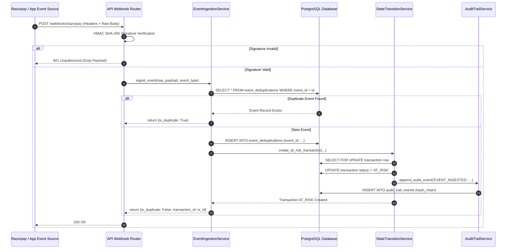
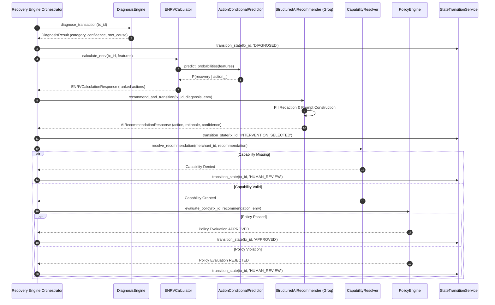
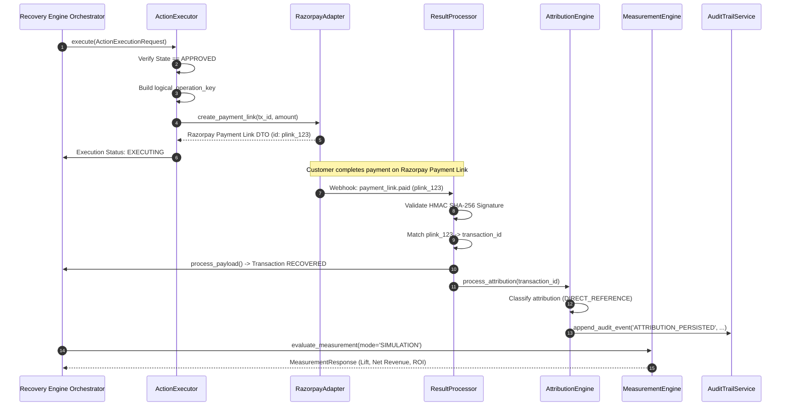

# RecoverAI — System Architecture Specification (Step 55)

**RAZORPAY AI BUILDATHON: TRACK 03 — AI REVENUE RECOVERY**  
**Document Version:** 1.0 (Frozen Architecture Specification)  
**Status:** VERIFIED & FROZEN  

---

## 1. Executive Summary & Core Philosophy

**RecoverAI** is an enterprise-grade, capability-aware, policy-bounded AI Revenue Recovery System engineered specifically for the Razorpay merchant ecosystem. It identifies transactions where revenue is at risk, diagnoses root causes, calculates Action-Conditional Expected Net Recovery Value ($ENRV$), verifies merchant operational capabilities, applies deterministic merchant safety policies, executes bounded interventions, attributes outcomes against a baseline control cohort, and maintains a continuous tamper-evident cryptographic audit log.

### Key Architectural Pillars
1. **AI Air-Gap Boundary:** Artificial Intelligence (Groq LLM) operates strictly in an advisory capacity. AI outputs pass through structured Pydantic validation and non-bypassable execution gates (`CapabilityResolver` and `PolicyEngine`) before any external action can be dispatched.
2. **Dual Operational Modes:**
   - **`REAL_TEST`**: Real Razorpay Test Mode execution using official APIs (`POST /v1/payment_links`), authentic HMAC SHA-256 webhook signatures (`payment_link.paid`), and fallback safety protection.
   - **`SIMULATION`**: High-throughput statistical evaluation across 50,000+ synthetic records for strategy validation without external API rate limits or monetary risk.
3. **Action-Conditional Expected Net Recovery Value ($ENRV$):** Evaluates candidate recovery actions using $ENRV(a_i) = P(R \mid X, a_i) \cdot \text{AmountInPaise} - \text{InterventionCost} - \text{OperationalCost} - \text{RefundCost}$ rather than generic recovery probability.
4. **Decoupled State Machine & DB Isolation:** Transaction lifecycle, payment state, execution state, and attribution state are strictly decoupled. State transitions are governed by `StateTransitionService` with database row-locking (`SELECT ... FOR UPDATE`).
5. **Tamper-Evident SHA-256 Cryptographic Audit Chaining:** Every state mutation appends a cryptographically linked event to `audit_trail_events` rooted at `GENESIS_HASH`.

---

## 2. Frozen Lifecycle Pipeline

The system processes payment failures through a strict 10-stage sequential pipeline:

```text
┌──────────┐    ┌──────────┐    ┌──────────┐    ┌────────────┐    ┌──────────┐
│  DETECT  │───>│ DIAGNOSE │───>│  DECIDE  │───>│ CAPABILITY │───>│  POLICY  │
└──────────┘    └──────────┘    └──────────┘    └────────────┘    └──────────┘
                                                                        │
┌──────────┐    ┌──────────┐    ┌──────────┐    ┌────────────┐          │
│  AUDIT   │<───│ MEASURE  │<───│ ATTRIBUTE│<───│   VERIFY   │<─────────┘
└──────────┘    └──────────┘    └──────────┘    └────────────┘
```

| Stage | Component | Functional Responsibility | Authoritative Output State |
|---|---|---|---|
| **1. DETECT** | `EventIngestionService` | Ingests webhooks, app events, or simulator events; normalizes canonical payloads; enforces ACID deduplication via `UNIQUE(event_id)`. | `AT_RISK` |
| **2. DIAGNOSE** | `DiagnosisEngine` | Precedence-based root cause diagnosis across 4 levels (Rules $\rightarrow$ ML Classifier $\rightarrow$ LLM Fallback $\rightarrow$ Human Review). Sanitizes PII. | `DIAGNOSED` |
| **3. DECIDE** | `ENRVCalculator` & `StructuredAIRecommender` | Computes $ENRV(a_i)$ for candidate actions via `ActionConditionalPredictor` (XGBoost); synthesizes Groq LLM advisory recommendation. | `INTERVENTION_SELECTED` |
| **4. CAPABILITY** | `CapabilityResolver` | Evaluates merchant capability matrix (enabled channels, API integrations, active features) prior to execution. | Checked Gate |
| **5. POLICY** | `PolicyEngine` | Applies deterministic merchant safety rules (cooldowns, amount thresholds, confidence limits, max retry attempts). Routes failures to escalation. | `APPROVED` or `HUMAN_REVIEW` |
| **6. EXECUTE** | `ActionExecutor` | Validates `APPROVED` state gate; checks defensive capability; generates `logical_operation_key`; dispatches action via `RazorpayAdapter`. | `EXECUTING` |
| **7. VERIFY** | `ResultProcessor` & `RazorpayAdapter` | Verifies authentic HMAC SHA-256 webhook signatures; ingests outcome events (`payment_link.paid`); updates payment state. | `RECOVERED` / `FAILED` / `EXPIRED` |
| **8. ATTRIBUTE** | `AttributionEngine` | Deterministically classifies outcome into `DIRECT_REFERENCE`, `WINDOW_MATCH`, `NATURAL_RECOVERY`, or `UNATTRIBUTED`. Enforces DB `UNIQUE` constraint. | Attributed Outcome |
| **9. MEASURE** | `MeasurementEngine` | Computes Treatment vs Control cohort metrics, Incremental Recovery Rate, and Net Recovered Revenue using `Decimal` arithmetic. | Persisted `EvaluationRun` |
| **10. AUDIT** | `AuditTrailService` | Computes SHA-256 hash link $H_n = \text{SHA256}(H_{n-1} \parallel \text{CanonicalJSON}(E_n))$ with DB row-locking (`SELECT ... FOR UPDATE`). | Verified Hash Chain |

---

## 3. System Sequence Diagrams

### 3.1 Event Ingestion & Deduplication Pipeline



---

### 3.2 AI Recommendation & Policy Evaluation Pipeline



---

### 3.3 Execution, Result Processing & Attribution Pipeline



---

## 4. Decoupled State Machine Lifecycles

RecoverAI enforces strict decoupling between 4 distinct lifecycles:

```text
TRANSACTION STATE      PAYMENT STATE        EXECUTION STATE       ATTRIBUTION STATE
┌───────────────┐     ┌─────────────┐      ┌───────────────┐     ┌────────────────┐
│   AT_RISK     │     │   PENDING   │      │    PENDING    │     │  UNATTRIBUTED  │
│      │        │     └──────┬──────┘      └───────┬───────┘     └───────┬────────┘
│      ▼        │            │                     │                     │
│   DIAGNOSED   │            ▼                     ▼                     ▼
│      │        │         ┌──────┐             ┌─────────┐       ┌───────────────┐
│      ▼        │         │ PAID │             │EXECUTING│       │DIRECT_REF /   │
│ INTERVENTION_ │         └──────┘             └────┬────┘       │WINDOW_MATCH / │
│   SELECTED    │            │                      │            │NATURAL_RECOV  │
│      │        │            ▼                      ▼            └───────────────┘
│      ▼        │        ┌────────┐            ┌─────────┐
│APPROVED/HUMAN │        │REFUNDED│            │ SUCCESS │
│    REVIEW     │        └────────┘            └─────────┘
│      │        │                                   │
│      ▼        │                                   ▼
│   EXECUTING   │                              ┌─────────┐
│      │        │                              │ FAILURE │
│      ▼        │                              └─────────┘
│  RECOVERED /  │
│FAILED/EXPIRED │
└───────────────┘
```

### Valid Transaction Lifecycle Transition Matrix

| Initial State | Allowed Target State | Triggering Mechanism / Authority |
|---|---|---|
| `AT_RISK` | `DIAGNOSED` | `DiagnosisEngine` classification completion |
| `DIAGNOSED` | `INTERVENTION_SELECTED` | `StructuredAIRecommender` / `ENRVCalculator` output |
| `INTERVENTION_SELECTED` | `APPROVED` | `PolicyEngine` evaluation passes with high confidence |
| `INTERVENTION_SELECTED` | `HUMAN_REVIEW` | `PolicyEngine` rejection or low-confidence score |
| `HUMAN_REVIEW` | `APPROVED` | Human Reviewer manual override (`APPROVE_OVERRIDE`) |
| `HUMAN_REVIEW` | `STOPPED` | Human Reviewer rejection (`REJECT_PERMANENT`) |
| `APPROVED` | `EXECUTING` | `ActionExecutor` action dispatch |
| `EXECUTING` | `RECOVERED` | `ResultProcessor` ingests verified `payment_link.paid` |
| `EXECUTING` | `FAILED` | Payment Link expires or fails permanently |
| `EXECUTING` | `EXPIRED` | Payment Link validity window lapses without payment |
| `EXECUTING` | `UNKNOWN` | Network timeout during Razorpay API call |
| `UNKNOWN` | `RECONCILIATION` | `ReconciliationEngine` scheduled worker polling |
| `RECONCILIATION` | `RECOVERED` / `FAILED` | `ReconciliationEngine` verifies external state |

---

## 5. Cryptographic SHA-256 Audit Chaining Specification

### 5.1 Link Computation Algorithm
Every state transition or critical audit event generates an `AuditEvent` record. The cryptographic hash link $H_n$ for sequence $n$ is computed deterministically as:

$$H_0 = \text{SHA256}(\text{"0000000000000000000000000000000000000000000000000000000000000000"})$$

$$H_n = \text{SHA256}\left(H_{n-1} \parallel \text{CanonicalJSON}(E_n)\right)$$

Where `CanonicalJSON` produces UTF-8 encoded, key-sorted JSON with zero whitespace whitespace:
```json
{"event_type":"STATE_TRANSITION","from_status":"APPROVED","merchant_id":"m_123","payload":{...},"to_status":"EXECUTING","transaction_id":"tx_456"}
```

### 5.2 Concurrency Mitigation (Fork Prevention)
To prevent audit chain forks under high concurrent event volume, `AuditTrailService` acquires a transaction-level exclusive lock before reading the previous audit event:

```python
stmt = (
    select(Transaction.id)
    .where(Transaction.id == transaction_id)
    .with_for_update()
)
await session.execute(stmt)
```

---

## 6. Dual Operational Modes & Execution Guidelines

```text
                        ┌──────────────────────────────┐
                        │   OPERATIONAL MODE SWITCH    │
                        └──────────────┬───────────────┘
                                       │
                ┌──────────────────────┴──────────────────────┐
                ▼                                             ▼
        ┌──────────────┐                              ┌──────────────┐
        │  REAL_TEST   │                              │  SIMULATION  │
        └──────┬───────┘                              └──────┬───────┘
               │                                             │
   • Real Razorpay Test API                       • 50,000+ Parquet Records
   • HMAC SHA-256 Webhooks                        • Pure Python Async Engine
   • Test Card Payments                           • Zero External Network Calls
   • Safe Test Credentials                        • Random Seed: 42 (Reproducible)
```

| Operational Parameter | `REAL_TEST` Mode | `SIMULATION` Mode |
|---|---|---|
| **Target Purpose** | E2E integration verification with Razorpay servers | Statistical lift & ROI evaluation over large datasets |
| **Dataset Scale** | Live test transactions / single failure injection | 50,000 synthetic transactions (Train/Val/Test) |
| **API Dispatches** | Actual `POST /v1/payment_links` in Test Mode | Simulated in-memory link generation |
| **Webhook Validation** | Live HMAC-SHA256 signature algorithm | Synthetic webhook generation with verified signatures |
| **Attribution Window**| 72 hours (configurable) | Simulated timestamp progression |
| **Financial Precision**| `Decimal` (minor unit paise integer conversion) | `Decimal` arithmetic precision |

---

## 7. Non-Bypassable Security Architecture

1. **AI Air-Gap Boundary:**
   - Groq LLM API responses are constrained to Pydantic JSON schemas.
   - LLM responses cannot execute functions, access database connections, or invoke network endpoints directly.
2. **Non-Bypassable Capability & Policy Gates:**
   - `ActionExecutor` re-verifies merchant capabilities via `CapabilityResolver` immediately prior to dispatching any command.
   - `PolicyEngine` evaluates safety rules (`cooldown_hours`, `max_amount`, `confidence_threshold`) as a mandatory condition for state transition from `INTERVENTION_SELECTED` to `APPROVED`.
3. **HMAC SHA-256 Webhook Verification:**
   - Webhook endpoints extract raw HTTP body bytes (`request.body()`) before JSON parsing to compute HMAC SHA-256 hex digest using merchant `webhook_secret`.
   - Constant-time string comparison (`hmac.compare_digest`) prevents timing side-channel attacks.
4. **Multi-Tenant Data Isolation:**
   - Every database query includes explicit tenant filtering: `.where(Model.merchant_id == current_user.merchant_id)`.
   - Foreign key constraints enforce relational scope.
