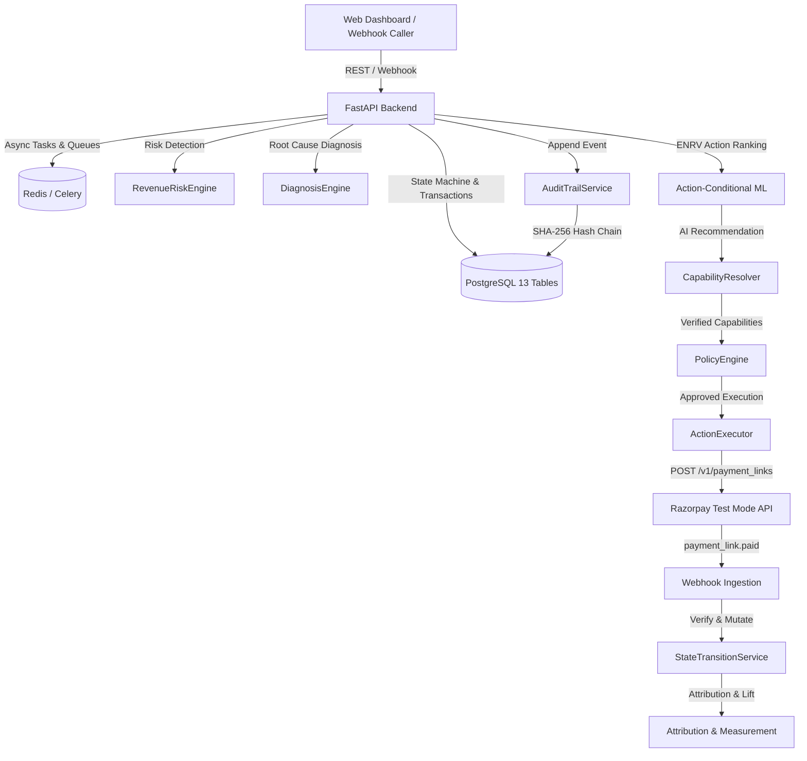

# RecoverAI — Dependency Map

## Component Interdependencies
1. **Database:** Postgres 16+ serving as single source of truth for 13 relational tables.
2. **State Transition Service:** Centralized gatekeeper for all state mutations using `SELECT ... FOR UPDATE` locking.
3. **AI Air-Gap:** `Diagnosis/ML` outputs recommendation $\rightarrow$ `CapabilityResolver` $\rightarrow$ `PolicyEngine` $\rightarrow$ `ActionExecutor`.
4. **Audit Trail:** Asynchronous & synchronous hash chaining (`GENESIS_HASH` $\rightarrow$ linked SHA-256 records).
5. **Razorpay Client:** Wrapper for `POST /v1/payment_links` and HMAC SHA-256 webhook validation.
