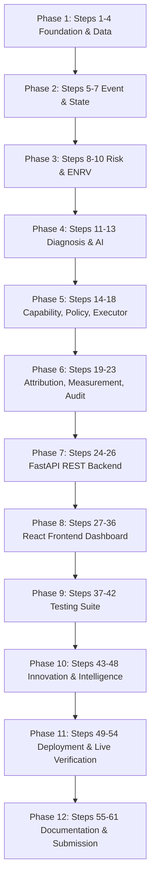

# RECOVERAI — FINAL IMPLEMENTATION MASTER PLAN
**RAZORPAY AI BUILDATHON: TRACK 03 — AI REVENUE RECOVERY**

---

## 00. EXECUTIVE SUMMARY

**RecoverAI** is an enterprise-grade, capability-aware, policy-bounded AI Revenue Recovery System designed for the Razorpay ecosystem. It identifies transactions where revenue is at risk, diagnoses root causes, calculates Action-Conditional Expected Net Recovery Value ($ENRV$), verifies operational capabilities, applies deterministic merchant safety policies, executes bounded interventions, attributes outcomes against a baseline control cohort, and maintains a continuous tamper-evident cryptographic audit log.

### Key Objectives & System Boundaries
1. **Track 03 Alignment:** Primary focus is pure AI Revenue Recovery (not fraud prevention, payment gateway cloning, or generic chatbots).
2. **Dual Operational Modes:**
   - `REAL_TEST`: Small-scale, real Razorpay Test Mode execution using verified APIs (`POST /v1/payment_links`).
   - `SIMULATION`: High-throughput synthetic evaluation on 50,000+ records for statistical validation of recovery strategies.
3. **Core ML Innovation:** Action-Conditional Expected Net Recovery Value ($ENRV$) model predicting $P(\text{recovery} \mid \text{features}, \text{action})$ rather than generic recovery probability.
4. **Safety & Compliance:** Absolute separation between AI recommendations and execution. Capability Resolver and Deterministic Policy Engine act as non-bypassable execution gates.
5. **Incremental Value:** ROI and recovery metrics are strictly evaluated as **Incremental Recovered Revenue** ($Treatment - Control$) adjusted for refunds.

---

## 00.1 PRE-IMPLEMENTATION CORRECTIONS OVERLAY & ARCHITECTURAL FREEZE

> [!IMPORTANT]
> **STATUS: ARCHITECTURE FROZEN WITH PRE-IMPLEMENTATION CORRECTIONS**
> All 27 pre-implementation correction rules have been permanently integrated into this Master Implementation Plan. No architectural modifications, re-ordering of steps, or strategy changes are permitted during step execution.

### Key Pre-Implementation Corrections Summary

1. **Razorpay Webhook Verification & Naming:** Webhook signature verification MUST use the raw HTTP request body bytes with HMAC-SHA256. `payment_link.paid` is the authoritative Payment Link success event for the primary recovery flow.
2. **Deterministic REAL_TEST Failure Injection:** Primary `REAL_TEST` demo uses a controlled test failure event (`APP_EVENT: PAYMENT_FAILED`) as the initial revenue-at-risk trigger. Recovery execution uses actual Razorpay Test Mode Payment Links (`POST /v1/payment_links`).
3. **Payment Link Creation Boundary:** Payment Link creation is an intervention, NOT recovered revenue. Revenue recovery requires a subsequent verified payment (`payment_link.paid`).
4. **`RECOVERY_MESSAGE` Capability Correction:** `RECOVERY_MESSAGE` is an application-level communication strategy (or simulation strategy), NOT a Razorpay API.
5. **Tamper-Evident Audit Terminology:** The audit trail uses **Tamper-Evident SHA-256 Hash Chaining** (`GENESIS_HASH`). We avoid false claims of absolute database immutability.
6. **Treatment / Control & Causal Claim Discipline:** Incremental recovery lift is an experimental estimate under defined cohort assignment assumptions, not guaranteed causal attribution.
7. **Configurable Policy Defaults:** Policy thresholds (₹50,000 max amount, 0.15 min probability, 3 max attempts, 24h cooldown, 72h attribution window) are versioned, merchant-configurable defaults.
8. **Operational vs Attribution Status:** `CONTROL` is a cohort assignment / measurement classification, NOT a transaction lifecycle status.
9. **UNKNOWN External Outcome Handling:** Gateway timeouts trigger state `UNKNOWN` and route to `RECONCILIATION` without creating duplicate execution attempts.
10. **50K+ Simulation Isolation:** 50,000 synthetic records evaluated in `SIMULATION` mode with zero outcome leakage into model features.

---

## 01. BUILDATHON REQUIREMENT MAPPING

| Buildathon Track Requirement | RecoverAI System Component | Technical Implementation Mechanism |
|---|---|---|
| **1. Detect revenue at risk** | `RevenueRiskEngine` | Evaluates eligible transaction amount, risk window, and risk conditions across 4 core scenarios. |
| **2. Diagnose root cause** | `DiagnosisEngine` | Precedence-based diagnosis: Deterministic Rules $\rightarrow$ ML Classifier $\rightarrow$ LLM Fallback $\rightarrow$ Human Review. |
| **3. Right intervention** | `ActionConditionalML` & `ENRV` | Ranks candidate actions by expected net revenue value: $ENRV = P \cdot \text{Amt} - \text{Costs}$. |
| **4. Bounded recovery workflow** | `CapabilityResolver` & `PolicyEngine` | Filters unsupported actions and enforces merchant safety constraints (cooldowns, amount limits, max retries). |
| **5. Measurable money recovered** | `MeasurementEngine` | Calculates Incremental Recovered Revenue against deterministic Control cohorts over 50,000+ simulation batch. |
| **6. Compliant escalation** | `HumanReviewService` | Routes low-confidence, high-value, or policy-rejected cases to human review queues with audit tracking. |
| **7. Stopping rules** | `PolicyEngine` & `Executor` | Non-negotiable stopping criteria (max retries reached, payment captured, attribution window expired). |
| **8. Audit trail** | `AuditTrailService` | Continuous SHA-256 cryptographic hash chaining (`GENESIS_HASH` $\rightarrow$ linked audit log). |

---

## 02. FROZEN ARCHITECTURE

```text
                               EVENT SOURCES
                                     │
                    ┌────────────────┼────────────────┐
                    ▼                ▼                ▼
             RAZORPAY WEBHOOKS    APP EVENTS       SIMULATOR
              Payment/Link/      Checkout/         50,000+
              Subscription       Receivables        Batch
                    │                │                │
                    ▼                │                │
              HMAC VERIFICATION      │                │
                    │                │                │
                    └────────────────┼────────────────┘
                                     ▼
                              EVENT INGESTION
                                     │
                           Authentication /
                           Schema Validation
                                     │
                                     ▼
                          EVENT NORMALIZATION
                                     │
                          DB Dedup Boundary
                                     │
                          UNIQUE(event_id)
                                     │
                                     ▼
                         STATE TRANSITION SERVICE
                         (Authoritative State
                          + DB Concurrency Lock)
                                     │
                                     ▼
                                AT_RISK
                                     │
                                     ▼
                            REVENUE AT RISK
                                     │
                                     ▼
                                DIAGNOSIS
                                     │
                         ┌───────────┴───────────┐
                         ▼                       ▼
                 Deterministic Rules            ML
                         │                       │
                         └───────────┬───────────┘
                                     ▼
                              LLM FALLBACK
                           (Structured Output)
                                     │
                                     ▼
                         ACTION-CONDITIONAL ML
                                     │
                     P(recovery | features, action)
                                     │
                                ENRV(action)
                                     │
                                     ▼
                                AI AGENT
                          Structured Recommendation
                                     │
                                     ▼
                          CAPABILITY RESOLVER
                          Remove Unsupported Actions
                                     │
                                     ▼
                           DETERMINISTIC POLICY
                                     │
                        Global → Merchant → Context
                                     │
                           ┌─────────┴─────────┐
                           ▼                   ▼
                        APPROVED            REJECTED
                           │                   │
                           ▼                   ▼
                     ACTION EXECUTOR      STOP / ESCALATE
                           │
                    Defensive Capability Check
                           │
                 Logical Operation Key
                 merchant:tx:cycle:action
                           │
                    UNIQUE DB Constraint
                           │
                    ┌──────┴──────┐
                    ▼             ▼
                 RAZORPAY      SIMULATOR
                 TEST MODE     SYNTHETIC MODE
                    │             │
                    └──────┬──────┘
                           │
                           ▼
                    EXECUTION RESULT
                           │
                 ┌─────────┼─────────┐
                 ▼         ▼         ▼
              SUCCESS   FAILURE    UNKNOWN
                 │         │         │
                 │         │         ▼
                 │         │   RECONCILIATION
                 │         │         │
                 │         │   Same Cycle +
                 │         │   Same Logical Key
                 │         │
                 └─────────┴─────────┘
                           │
                           ▼
                     VERIFY RESULT
                           │
                           ▼
                    PAYMENT STATE
                           │
                 ┌─────────┼─────────┐
                 ▼         ▼         ▼
              CAPTURED  AUTHORIZED  REFUNDED
                 │         │
                 │         ▼
                 │    CAPTURE_PENDING
                 │
                 ▼
                  ATTRIBUTION ENGINE
                           │
              ┌────────────┼────────────┐
              ▼            ▼            ▼
          ATTRIBUTED     NATURAL     UNATTRIBUTED
              │          RECOVERY
              ▼
          RECOVERED
                           │
                           ▼
                    MEASUREMENT ENGINE
                           │
                 ┌─────────┴─────────┐
                 ▼                   ▼
              CONTROL             RECOVERAI
                 │                   │
                 ▼                   ▼
           Baseline Rate       Recovery Rate
                 │                   │
                 └─────────┬─────────┘
                           ▼
                 INCREMENTAL RECOVERY
                           │
                           ▼
                    REFUND ADJUSTMENT
                           │
                           ▼
                    NET RECOVERY
                           │
                           ▼
                     AUDIT TRAIL
                (continuous throughout
                    lifecycle)
                           │
                           ▼
                 COMMAND CENTER
                    DASHBOARD
                           │
                    ┌──────┴──────┐
                    ▼             ▼
                 REAL_TEST     SIMULATION
```

---

## 03. ARCHITECTURE RULES

1. **Non-Modifiable Pipeline:** The 6-stage lifecycle (`DETECT` $\rightarrow$ `DIAGNOSE` $\rightarrow$ `DECIDE` $\rightarrow$ `EXECUTE` $\rightarrow$ `VERIFY` $\rightarrow$ `ATTRIBUTE` $\rightarrow$ `MEASURE` $\rightarrow$ `AUDIT`) is frozen.
2. **AI Air-Gap:** AI outputs recommendations only. It has zero network access to payment gateways or write privileges to financial tables.
3. **Execution Safety Gate:** All recovery attempts MUST pass `CapabilityResolver` then `PolicyEngine` before reaching `ActionExecutor`.
4. **Idempotency Guarantee:** Executions require a UNIQUE `logical_operation_key` (`merchant_id:transaction_id:recovery_cycle:action`) enforced by database constraints.
5. **Technical vs Business Retries:** Network timeouts/DB errors retry within the *same* `recovery_cycle` and key. Strategy changes increment `recovery_cycle`.
6. **Mode Isolation:** `REAL_TEST` and `SIMULATION` data, execution paths, and metrics are completely isolated in reporting.

---

## 04. TECHNOLOGY STACK

- **Backend:** Python 3.11+, FastAPI, Pydantic v2, SQLAlchemy 2.0 (AsyncIO), Alembic.
- **Database:** PostgreSQL 15+ (Relational state & JSONB payload storage).
- **Caching & Async Tasks:** Redis 7+, Celery (Background workers & event queues).
- **ML / Data Science:** Scikit-Learn, XGBoost, Pandas, NumPy, Joblib.
- **AI Integration:** OpenAI GPT-4o / Anthropic Claude (Structured JSON output via Instructor/Pydantic).
- **Frontend:** React 18, TypeScript, Vite, TailwindCSS, Lucide Icons, Recharts.
- **Testing & Verification:** Pytest, HTTPX, Playwright (E2E testing).
- **Payment Gateway:** Razorpay Python SDK & official REST APIs.

---

## 05. REPOSITORY STRUCTURE

```text
RecoverAI/
├── backend/
│   ├── alembic/
│   ├── app/
│   │   ├── api/          # FastAPI routers (webhooks, transactions, analytics)
│   │   ├── core/         # Config, DB session, security, hashing
│   │   ├── models/       # SQLAlchemy 2.0 declarative models
│   │   ├── schemas/      # Pydantic v2 validation schemas
│   │   ├── services/     # Core domain services (State, Risk, Policy, Audit)
│   │   ├── ml/           # Model training, inference, feature extraction
│   │   ├── ai/           # Structured LLM recommender & diagnosis fallback
│   │   ├── policies/     # Deterministic safety policy rules engine
│   │   ├── integrations/ # Razorpay API adapters & HTTP clients
│   │   └── workers/      # Celery background tasks & queues
│   ├── tests/            # Pytest test suites (Unit, Integration, E2E)
│   ├── requirements.txt
│   └── main.py
├── frontend/
│   ├── src/
│   │   ├── components/   # UI components (Tables, Charts, Badges, Modals)
│   │   ├── pages/        # 9 Dashboard pages (Command Center, Audit, etc.)
│   │   ├── services/     # API client endpoints
│   │   ├── types/        # TypeScript interfaces
│   │   └── App.tsx
│   ├── package.json
│   └── vite.config.ts
├── docs/                 # System architecture, API specs, ML specs, Security
└── scripts/              # Dataset generation, seed scripts, evaluation runners
```

---

## 06. DATABASE ARCHITECTURE

```sql
-- Core Relational Schema (PostgreSQL)

CREATE TABLE merchants (
    id VARCHAR(36) PRIMARY KEY,
    name VARCHAR(255) NOT NULL,
    email VARCHAR(255) NOT NULL,
    industry VARCHAR(100) NOT NULL,
    created_at TIMESTAMP WITH TIME ZONE DEFAULT CURRENT_TIMESTAMP
);

CREATE TABLE customers (
    id VARCHAR(36) PRIMARY KEY,
    merchant_id VARCHAR(36) NOT NULL REFERENCES merchants(id) ON DELETE CASCADE,
    email VARCHAR(255) NOT NULL,
    phone VARCHAR(50),
    name VARCHAR(255),
    historical_success_rate FLOAT NULL,
    historical_transaction_count INT DEFAULT 0,
    created_at TIMESTAMP WITH TIME ZONE DEFAULT CURRENT_TIMESTAMP,
    CONSTRAINT uk_merchant_customer_email UNIQUE (merchant_id, email)
);

CREATE TABLE transactions (
    id VARCHAR(36) PRIMARY KEY,
    merchant_id VARCHAR(36) NOT NULL REFERENCES merchants(id),
    customer_id VARCHAR(36) NOT NULL REFERENCES customers(id),
    razorpay_payment_id VARCHAR(100) NULL,
    razorpay_order_id VARCHAR(100) NULL,
    razorpay_payment_link_id VARCHAR(100) NULL,
    razorpay_subscription_id VARCHAR(100) NULL,
    razorpay_invoice_id VARCHAR(100) NULL,
    amount NUMERIC(12, 2) NOT NULL,
    currency VARCHAR(10) DEFAULT 'INR',
    status VARCHAR(50) NOT NULL,
    scenario_type VARCHAR(50) NOT NULL,
    retry_count INT DEFAULT 0,
    recovery_cycle INT DEFAULT 1,
    mode VARCHAR(20) NOT NULL DEFAULT 'SIMULATION',
    created_at TIMESTAMP WITH TIME ZONE DEFAULT CURRENT_TIMESTAMP,
    updated_at TIMESTAMP WITH TIME ZONE DEFAULT CURRENT_TIMESTAMP
);

CREATE TABLE events (
    id VARCHAR(36) PRIMARY KEY,
    transaction_id VARCHAR(36) REFERENCES transactions(id),
    event_type VARCHAR(100) NOT NULL,
    event_source VARCHAR(100) NOT NULL,
    payload JSONB NOT NULL,
    idempotency_key VARCHAR(255) UNIQUE NOT NULL,
    razorpay_event_id VARCHAR(255) UNIQUE NULL,
    created_at TIMESTAMP WITH TIME ZONE DEFAULT CURRENT_TIMESTAMP
);

CREATE TABLE decision_contexts (
    id VARCHAR(36) PRIMARY KEY,
    transaction_id VARCHAR(36) NOT NULL REFERENCES transactions(id),
    model_version VARCHAR(50) NOT NULL,
    feature_version VARCHAR(50) NOT NULL,
    policy_version VARCHAR(50) NOT NULL,
    created_at TIMESTAMP WITH TIME ZONE DEFAULT CURRENT_TIMESTAMP
);

CREATE TABLE recovery_action_scores (
    id VARCHAR(36) PRIMARY KEY,
    decision_context_id VARCHAR(36) NOT NULL REFERENCES decision_contexts(id) ON DELETE CASCADE,
    transaction_id VARCHAR(36) NOT NULL REFERENCES transactions(id),
    action VARCHAR(100) NOT NULL,
    recovery_probability FLOAT NOT NULL,
    expected_gross_recovery NUMERIC(12, 2) NOT NULL,
    intervention_cost NUMERIC(12, 2) NOT NULL,
    expected_net_recovery_value NUMERIC(12, 2) NOT NULL,
    created_at TIMESTAMP WITH TIME ZONE DEFAULT CURRENT_TIMESTAMP,
    CONSTRAINT uk_decision_action UNIQUE (decision_context_id, action)
);

CREATE TABLE diagnoses (
    id VARCHAR(36) PRIMARY KEY,
    transaction_id VARCHAR(36) NOT NULL REFERENCES transactions(id),
    failure_code VARCHAR(100) NOT NULL,
    failure_category VARCHAR(100) NOT NULL,
    root_cause_explanation TEXT NOT NULL,
    confidence_score FLOAT NOT NULL,
    diagnosis_source VARCHAR(50) NOT NULL,
    created_at TIMESTAMP WITH TIME ZONE DEFAULT CURRENT_TIMESTAMP
);

CREATE TABLE policies (
    id VARCHAR(36) PRIMARY KEY,
    merchant_id VARCHAR(36) REFERENCES merchants(id),
    policy_version VARCHAR(50) NOT NULL DEFAULT 'v1.0',
    max_recovery_attempts INT DEFAULT 3,
    max_auto_action_amount NUMERIC(12, 2) DEFAULT 50000.00,
    min_recovery_probability FLOAT DEFAULT 0.15,
    cooldown_hours INT DEFAULT 24,
    is_active BOOLEAN DEFAULT TRUE,
    created_at TIMESTAMP WITH TIME ZONE DEFAULT CURRENT_TIMESTAMP
);

CREATE TABLE recovery_attempts (
    id VARCHAR(36) PRIMARY KEY,
    transaction_id VARCHAR(36) NOT NULL REFERENCES transactions(id),
    decision_context_id VARCHAR(36) REFERENCES decision_contexts(id),
    logical_operation_key VARCHAR(255) UNIQUE NOT NULL,
    recommended_action VARCHAR(100) NOT NULL,
    action_payload JSONB NOT NULL,
    policy_status VARCHAR(50) NOT NULL,
    policy_reason TEXT,
    policy_version VARCHAR(50) NOT NULL,
    execution_status VARCHAR(50) NOT NULL,
    external_resource_type VARCHAR(50) NOT NULL,
    external_resource_id VARCHAR(100) NULL,
    razorpay_payment_link_id VARCHAR(100) NULL,
    razorpay_reference_id VARCHAR(100) NULL,
    executed_at TIMESTAMP WITH TIME ZONE,
    created_at TIMESTAMP WITH TIME ZONE DEFAULT CURRENT_TIMESTAMP
);

CREATE TABLE recovery_attributions (
    id VARCHAR(36) PRIMARY KEY,
    transaction_id VARCHAR(36) NOT NULL REFERENCES transactions(id),
    recovery_attempt_id VARCHAR(36) REFERENCES recovery_attempts(id),
    recovery_source VARCHAR(50) NOT NULL,
    attribution_status VARCHAR(50) NOT NULL,
    attribution_method VARCHAR(50) NOT NULL,
    attribution_window_minutes INT DEFAULT 1440,
    recovered_amount NUMERIC(12, 2) NOT NULL,
    refunded_amount NUMERIC(12, 2) DEFAULT 0.00,
    intervention_timestamp TIMESTAMP WITH TIME ZONE,
    recovery_timestamp TIMESTAMP WITH TIME ZONE DEFAULT CURRENT_TIMESTAMP,
    CONSTRAINT uk_tx_attempt_attribution UNIQUE (transaction_id, recovery_attempt_id)
);

CREATE TABLE audit_events (
    id VARCHAR(36) PRIMARY KEY,
    transaction_id VARCHAR(36) NOT NULL REFERENCES transactions(id),
    event_type VARCHAR(100) NOT NULL,
    actor VARCHAR(100) NOT NULL,
    state_from VARCHAR(50),
    state_to VARCHAR(50),
    details JSONB NOT NULL,
    previous_hash VARCHAR(64) NOT NULL,
    event_hash VARCHAR(64) NOT NULL,
    created_at TIMESTAMP WITH TIME ZONE DEFAULT CURRENT_TIMESTAMP
);

CREATE TABLE evaluation_runs (
    id VARCHAR(36) PRIMARY KEY,
    run_name VARCHAR(255) NOT NULL,
    dataset_version VARCHAR(50) NOT NULL,
    dataset_size INT NOT NULL,
    random_seed INT NOT NULL DEFAULT 42,
    model_version VARCHAR(50) NOT NULL,
    feature_version VARCHAR(50) NOT NULL,
    policy_version VARCHAR(50) NOT NULL,
    configuration_version VARCHAR(50) NOT NULL,
    code_commit_sha VARCHAR(100) NULL,
    mode VARCHAR(20) NOT NULL DEFAULT 'SIMULATION',
    revenue_at_risk NUMERIC(12, 2) NOT NULL,
    baseline_recovered_amount NUMERIC(12, 2) NOT NULL,
    recoverai_gross_recovered_amount NUMERIC(12, 2) NOT NULL,
    incremental_recovered_amount NUMERIC(12, 2) NOT NULL,
    baseline_recovery_rate FLOAT NOT NULL,
    recoverai_recovery_rate FLOAT NOT NULL,
    summary_metrics JSONB NOT NULL,
    created_at TIMESTAMP WITH TIME ZONE DEFAULT CURRENT_TIMESTAMP
);

CREATE INDEX idx_transactions_status ON transactions(status);
CREATE INDEX idx_transactions_mode ON transactions(mode);
CREATE INDEX idx_events_idempotency ON events(idempotency_key);
CREATE INDEX idx_audit_tx_hash ON audit_events(transaction_id, event_hash);
```

---

## 07. EVENT ARCHITECTURE

RecoverAI processes events from three strict sources:
1. `RAZORPAY_WEBHOOK`: Verified asynchronously via HMAC SHA-256 signature using raw HTTP request body bytes (`X-Razorpay-Signature`).
2. `APP_EVENT`: Internal merchant applications emitting checkout drop-offs or receivable milestones (Authenticated via API Key/JWT).
3. `SIMULATOR`: Batch processing execution engine handling 50,000+ synthetic transactions.

All incoming events pass through:
`Raw Ingestion` $\rightarrow$ `Security Verification` $\rightarrow$ `Normalization` $\rightarrow$ `PostgreSQL Unique Constraint Deduplication` $\rightarrow$ `State Transition Pipeline`.

---

## 08. STATE MACHINES

Four decoupled state lifecycles govern the system:

1. **Transaction / Recovery Lifecycle (`transactions.status`):**
   `CREATED` $\rightarrow$ `AT_RISK` $\rightarrow$ `DIAGNOSED` $\rightarrow$ `INTERVENTION_SELECTED` $\rightarrow$ `POLICY_CHECK` $\rightarrow$ `APPROVED` $\rightarrow$ `EXECUTING` $\rightarrow$ [`RECOVERED` | `FAILED` | `STOPPED` | `ESCALATED` | `EXPIRED` | `REFUNDED`].
2. **Payment Lifecycle:**
   `CREATED` $\rightarrow$ `AUTHORIZED` $\rightarrow$ `CAPTURE_PENDING` $\rightarrow$ `CAPTURED` $\rightarrow$ `REFUNDED`.
3. **Execution Lifecycle (`recovery_attempts.execution_status`):**
   `PENDING` $\rightarrow$ `EXECUTING` $\rightarrow$ [`SUCCESS` | `FAILURE` | `UNKNOWN` $\rightarrow$ `RECONCILIATION` $\rightarrow$ `RECONCILED`].
4. **Attribution Status (`recovery_attributions.attribution_status`):**
   `ATTRIBUTED` | `NATURAL_RECOVERY` | `UNATTRIBUTED` (Note: `CONTROL` is a evaluation cohort, not an attribution status).

---

## 09. REVENUE RISK ENGINE

Evaluates transactions against 4 business scenario classes:
1. `PAYMENT_FAILURE`: Hard or soft gateway transaction declines.
2. `CHECKOUT_ABANDONMENT`: Drop-offs after order creation prior to gateway authorization.
3. `SUBSCRIPTION_FAILURE`: Recurring charge authorization failures.
4. `OVERDUE_RECEIVABLE`: B2B invoice past-due payment schedules.

Calculates **Eligible Revenue at Risk** ($Amount \times RiskScore$) and establishes eligibility windows.

---

## 10. DIAGNOSIS ENGINE

Root-cause classification follows a strict precedence model:
1. **Deterministic Mapping:** Error code lookup (e.g., `BAD_REQUEST_PAYMENT_TIMED_OUT` $\rightarrow$ `TEMPORARY_GATEWAY_TIMEOUT`).
2. **ML Classifier:** XGBoost classification model trained on historical decline patterns.
3. **Structured LLM Fallback:** Invoked only for unstructured or ambiguous decline payloads (Output validated via Pydantic).
4. **Human Review / Unknown:** Fallback when confidence is below configured threshold (default < 0.60).

---

## 11. ML ARCHITECTURE

### Action-Conditional Recovery Model ($P(\text{recovery} \mid \text{features}, \text{action})$)
Instead of predicting generic recovery probability, RecoverAI evaluates probabilities conditional on candidate recovery actions:
- Candidate Actions: `PAYMENT_LINK`, `RECOVERY_MESSAGE`, `SUBSCRIPTION_RECOVERY`, `RETRY`, `STOP`, `ESCALATE`.
- Output: Array of action probabilities $P(R \mid X, a_i)$.

### Expected Net Recovery Value ($ENRV$) Calculation
$$ENRV(a_i) = P(\text{recovery} \mid X, a_i) \cdot \text{Amount} - \text{InterventionCost}(a_i) - \text{OperationalCost}(a_i) - \text{ExpectedRefundCost}(a_i)$$

---

## 12. AI RECOMMENDER

The LLM (GPT-4o / Claude) operates inside a strict sandbox:
- Receives: Anonymized transaction context, customer history features, diagnosis output.
- Generates: Action recommendation, structured rationale, and personalized customer messaging.
- Validates: Pydantic response schema. LLM cannot call external APIs or bypass policy gates.

---

## 13. CAPABILITY RESOLVER

Inspects requested interventions against operational capabilities before policy evaluation:
- In `REAL_TEST` mode: Filters out unsupported actions (e.g., `RETRY` marked as `UNSUPPORTED`/`REQUIRES_VERIFICATION` unless tokenized backend integration exists; defaults to `PAYMENT_LINK`).
- In `SIMULATION` mode: Enables model evaluation for full strategy catalog.

---

## 14. POLICY ENGINE

Applies deterministic safety policies in hierarchical order:
1. **Global Safety Rules:** Amount caps ($\le ₹50,000$), max attempts ($\le 3$).
2. **Merchant Policy Rules:** Merchant-customized blackout windows and preferred channels.
3. **Transaction Context Rules:** Minimum probability threshold ($\ge 0.15$).

Outputs: `APPROVED` or `REJECTED` (with explicit `policy_reason_code`).

---

## 15. ACTION EXECUTOR

Responsible for invoking approved recovery operations:
- Verifies defensive capability checks.
- Generates and enforces `logical_operation_key`.
- In `REAL_TEST`: Calls Razorpay `POST /v1/payment_links`.
- In `SIMULATION`: Invokes synthetic response generator.
- Handles timeout gracefully by setting state to `UNKNOWN` and triggering Reconciliation.

---

## 16. RAZORPAY INTEGRATION

- Primary verified executable endpoint: `POST /v1/payment_links` (Create Payment Link).
- Webhook verification: HMAC-SHA256 signature checking on `payment.captured`, `payment.failed`, `payment_link.paid`.
- Strictly respects Razorpay Test Mode creation limit (up to 30 Payment Links per business).

---

## 17. RECONCILIATION

Activated whenever execution results in `UNKNOWN` (e.g., HTTP gateway timeout):
- Queries Razorpay `GET /v1/payment_links/{id}` or `GET /v1/payments/{id}` using stored reference.
- Reconciles external state to `SUCCESS` or `FAILURE` without creating duplicate execution cycles.

---

## 18. ATTRIBUTION

Links captured payments to active recovery attempts:
- **Direct Reference (`DIRECT_REFERENCE`):** Payment Link ID matches `recovery_attempts.razorpay_payment_link_id`.
- **Window Match (`WINDOW_MATCH`):** Payment captured within configured window (e.g., 72 hours) following intervention.
- Outcome Classifications: `ATTRIBUTED`, `NATURAL_RECOVERY`, `UNATTRIBUTED`.

---

## 19. MEASUREMENT

Calculates net incremental financial impact:
$$\text{Incremental Recovery Rate} = \text{Treatment Recovery Rate} - \text{Control Recovery Rate}$$
$$\text{Net Incremental Recovered Revenue} = (\text{Incremental Recovery Rate} \times \text{Treatment Eligible Amount}) - \text{Refunds} - \text{Intervention Costs}$$

---

## 20. AUDIT TRAIL

Continuous cryptographic hash chaining:
$$\text{event\_hash}_n = \text{SHA256}(\text{canonical\_json}(\text{record}_n) + \text{event\_hash}_{n-1})$$
Initial record links to `GENESIS_HASH`. Serialized via row-level locks to prevent chain forks.

---

## 21. BACKEND ARCHITECTURE

Modular monolith built on FastAPI:
- Routers: `/api/v1/webhooks`, `/api/v1/transactions`, `/api/v1/analytics`, `/api/v1/audit`, `/api/v1/policies`, `/api/v1/evaluations`.
- Async database operations via SQLAlchemy 2.0 + AsyncPG.
- Background task processing for ML inference and simulation batches via Celery.

---

## 22. API SPECIFICATION

Exposes RESTful endpoints for dashboard consumption and webhook reception:
- `POST /api/v1/webhooks/razorpay`: Razorpay webhook ingestion.
- `GET /api/v1/transactions`: Transaction listing with status and filters.
- `GET /api/v1/transactions/{id}`: Detailed transaction breakdown with audit timeline.
- `GET /api/v1/analytics/summary`: Top-level Command Center metrics.
- `GET /api/v1/audit`: Complete tamper-evident audit log with validation endpoint.

---

## 23. FRONTEND ARCHITECTURE

React 18 TypeScript SPA built with Vite & TailwindCSS:
- State management: React Query / Zustand.
- Visualizations: Recharts for recovery trends, financial metrics, and confusion matrices.
- Mode indicators: Persistent visual badges for `REAL_TEST` vs `SIMULATION`.

---

## 24. DASHBOARD

Consists of 9 specialized UI pages:
1. **Command Center:** Real-time revenue recovery stats and system health.
2. **Revenue Risk:** Active at-risk transaction queue.
3. **Recovery Queue:** Pending interventions and automated actions.
4. **Transaction Detail:** Full end-to-end lifecycle view for a single transaction.
5. **AI Decision Center:** ENRV breakdowns, candidate action scores, LLM explanations.
6. **Recovery Analytics:** Treatment vs Control performance charts and net ROI.
7. **Audit Center:** Cryptographic audit trail inspector with one-click chain verification.
8. **Policy Manager:** Configurable merchant safety rules and thresholds.
9. **Human Review:** Escalated transaction review queue.

---

## 25. DATASET

50,000+ synthetic records generated deterministically (`random_seed=42`):
- Covers all 4 scenario classes (`PAYMENT_FAILURE`, `CHECKOUT_ABANDONMENT`, `SUBSCRIPTION_FAILURE`, `OVERDUE_RECEIVABLE`).
- Complete feature set: Customer tenure, historical success rate, decline codes, checkout context.

---

## 26. EVALUATION

- **Split:** 70% Train / 15% Validation / 15% Test (Temporal split, zero customer overlap).
- **ML Metrics:** Precision, Recall, F1, ROC-AUC, Brier score calibration.
- **Business Metrics:** Recovery Rate, Incremental Lift, Net Recovered Revenue.

---

## 27. SECURITY

- HMAC SHA-256 signature verification on raw webhook body.
- Role-Based Access Control (RBAC) and merchant isolation.
- PII masking/minimization for LLM prompts.
- Zero secret leakage (API keys strictly managed via environment variables).

---

## 28. FAILURE ENGINEERING

Defensive handlers for 25 failure modes including:
- Webhook signature mismatch $\rightarrow$ Immediate 401 rejection.
- Gateway timeout $\rightarrow$ State set to `UNKNOWN` $\rightarrow$ Celery reconciliation worker.
- Concurrent webhook delivery $\rightarrow$ PostgreSQL `SELECT ... FOR UPDATE` row locks.

---

## 29. OBSERVABILITY

- Structured JSON logging with unified tracing context (`trace_id`, `transaction_id`, `merchant_id`).
- Prometheus-compatible metrics tracking API latency, recovery rates, and policy rejections.

---

## 30. TESTING STRATEGY

- **Unit Tests:** Pytest coverage for core algorithms, ENRV calculations, policy rules.
- **Integration Tests:** Database transactions, webhook ingestion pipelines, Redis lock checks.
- **E2E Tests:** Playwright validation of full frontend flow.

---

## 31. DEPLOYMENT

- Containerized via Docker & Docker Compose (FastAPI backend, React frontend, PostgreSQL, Redis, Celery worker).
- Environment configuration managed via `.env` files.

---

## 32. REAL TEST MODE DEMO

5-minute live demonstration flow:
1. Trigger controlled test failure event (`APP_EVENT: PAYMENT_FAILED`).
2. Ingest event & move transaction to `AT_RISK`.
3. Generate diagnosis & calculate ENRV.
4. Resolve capability (`PAYMENT_LINK`) & pass policy check.
5. Generate Razorpay Test Payment Link (`POST /v1/payment_links`).
6. Complete payment in Razorpay test portal.
7. Receive `payment_link.paid` webhook, verify HMAC signature, verify payment, attribute recovery, update dashboard, verify audit hash chain.


---

## 33. 50K+ SIMULATION DEMO

Demonstrates execution across 50,000 synthetic transactions comparing RecoverAI Treatment against Control baseline, displaying statistically significant incremental recovery lift.

---

## 34. INNOVATION

Action-Conditional Recovery Optimization ($ENRV$) combined with continuous tamper-evident audit chaining and capability-aware execution.

---

## 35. MANUAL TASKS

Tasks requiring developer action:
- Obtaining Razorpay Test API Keys (`key_id`, `key_secret`).
- Configuring Webhook Secret in Razorpay Dashboard.
- Providing OpenAI/Anthropic API keys in `.env`.
- Recording pitch video.

---

## 36. IDE TASKS

Tasks executed by code generation tools:
- Database models, Alembic migrations, schemas.
- Service implementations (Risk, ML, AI, Policy, Audit, Executor).
- Frontend React components and dashboard pages.
- Pytest test suites and evaluation scripts.

---

## 37. EXTERNAL TASKS

Third-party system dependencies:
- Razorpay Payment Link API execution.
- LLM API inference requests.

---

## 38. COMPLETE STEP 1: Repository & Project Setup

1. **Objective:** Establish the foundational directory structure, configuration management, dependency definitions, and virtual environment for the RecoverAI backend and frontend.
2. **Why This Step Exists:** Ensures consistent development environment, clear separation of concerns, and reproducible builds across developer and production environments.
3. **Dependencies:** None.
4. **Inputs:** Project naming conventions, Python 3.11 requirement, Node.js 18+ requirement.
5. **Outputs:** Initialized git repository, backend directory tree, frontend directory tree, `requirements.txt`, `package.json`, `.env.example`.
6. **Exact Files/Directories:**
   - `backend/app/{api,core,models,schemas,services,ml,ai,policies,integrations,workers}`
   - `frontend/src/{components,pages,services,hooks,types}`
   - `docs/`, `scripts/`, `alembic/`
   - `.env.example`, `requirements.txt`, `package.json`
7. **Detailed Subtasks:**
   - 7.1 Create standard directory skeleton for backend, frontend, docs, and scripts.
   - 7.2 Configure `requirements.txt` with locked versions (FastAPI, SQLAlchemy, Pydantic, XGBoost, etc.).
   - 7.3 Configure `package.json` with React, TypeScript, Vite, TailwindCSS, and Lucide icons.
   - 7.4 Create `backend/app/core/config.py` using Pydantic Settings to parse environment variables.
   - 7.5 Setup `.gitignore` excluding `.env`, virtualenvs, node_modules, and build outputs.
8. **Database Changes:** None.
9. **Backend Changes:** Added Pydantic core settings schema in `backend/app/core/config.py`.
10. **Frontend Changes:** Initialized React TypeScript app structure with Vite configuration.
11. **ML/AI Changes:** None.
12. **External Integration:** None.
13. **Environment Variables:** `DATABASE_URL`, `REDIS_URL`, `RAZORPAY_KEY_ID`, `RAZORPAY_KEY_SECRET`, `RAZORPAY_WEBHOOK_SECRET`, `OPENAI_API_KEY`.
14. **Security Requirements:** `.env` files must be excluded from version control.
15. **Failure Modes:** Missing environment variables causing application bootstrap failure.
16. **Recovery/Rollback:** Provide default fallback values for non-sensitive local development settings in `config.py`.
17. **Tests:** Test settings loader in `backend/tests/test_config.py`.
18. **Verification Commands:** `pytest backend/tests/test_config.py`
19. **Expected Result:** Environment variables parse correctly with zero validation errors.
20. **Exit Criteria:** Virtual environment installs successfully and configuration unit test passes.
21. **Manual User Tasks:** [MANUAL] Copy `.env.example` to `.env` and fill in API keys.
22. **IDE-Automatable Tasks:** [IDE] File creation, dependency definitions, configuration parsing script.

---

## 39. COMPLETE STEP 2: Database Architecture

1. **Objective:** Define SQLAlchemy 2.0 models and Alembic migrations for all 13 core relational tables.
2. **Why This Step Exists:** Provides persistent, ACID-compliant storage for transactions, events, recovery attempts, policy decisions, and tamper-evident audit logs.
3. **Dependencies:** Step 1.
4. **Inputs:** Database schema specification (Section 06).
5. **Outputs:** SQLAlchemy models in `backend/app/models/`, initial Alembic migration script.
6. **Exact Files/Directories:**
   - `backend/app/models/domain.py`
   - `backend/app/core/database.py`
   - `alembic/versions/001_initial_schema.py`
7. **Detailed Subtasks:**
   - 7.1 Implement SQLAlchemy declarative base and session factory in `core/database.py`.
   - 7.2 Define `Merchant`, `Customer`, `Transaction`, `Event`, `Diagnosis`, `DecisionContext`, `RecoveryActionScore`, `Policy`, `RecoveryAttempt`, `RecoveryAttribution`, `AuditEvent`, `EvaluationRun` models.
   - 7.3 Add explicit constraints (`UNIQUE(logical_operation_key)`, `UNIQUE(idempotency_key)`, monetary `NUMERIC(12, 2)` columns).
   - 7.4 Configure Alembic and generate initial migration script.
   - 7.5 Implement database health-check utility script.
8. **Database Changes:** Creation of 13 tables and associated indexes.
9. **Backend Changes:** Async SQLAlchemy DB connection manager.
10. **Frontend Changes:** None.
11. **ML/AI Changes:** None.
12. **External Integration:** PostgreSQL server connection.
13. **Environment Variables:** `DATABASE_URL`.
14. **Security Requirements:** Least-privilege DB user permissions; parameterized queries via SQLAlchemy.
15. **Failure Modes:** Connection drop or migration failure due to missing database.
16. **Recovery/Rollback:** `alembic downgrade base`.
17. **Tests:** `backend/tests/test_database.py` verifying table creation and constraints.
18. **Verification Commands:** `alembic upgrade head && pytest backend/tests/test_database.py`
19. **Expected Result:** 13 tables created in PostgreSQL with matching indexes and constraints.
20. **Exit Criteria:** Alembic migration runs cleanly with zero errors.
21. **Manual User Tasks:** [MANUAL] Ensure PostgreSQL database exists.
22. **IDE-Automatable Tasks:** [IDE] SQLAlchemy models, Alembic configuration, migration scripts.

---

## 40. COMPLETE STEP 3: Synthetic Dataset Generation

1. **Objective:** Generate a deterministic, 50,000+ record dataset representing revenue-at-risk transactions across 4 core scenarios.
2. **Why This Step Exists:** Enables statistical simulation, ML training, and policy evaluation without relying on sensitive live merchant data.
3. **Dependencies:** Step 1, Step 2.
4. **Inputs:** Scenario definitions, historical decline statistics, random seed 42.
5. **Outputs:** `scripts/generate_synthetic_dataset.py`, CSV/Parquet dataset files in `data/synthetic_50k.parquet`.
6. **Exact Files/Directories:**
   - `scripts/generate_synthetic_dataset.py`
   - `backend/app/services/dataset_generator.py`
   - `data/synthetic_50k.parquet`
7. **Detailed Subtasks:**
   - 7.1 Implement data generator using NumPy and Pandas with `random_seed=42`.
   - 7.2 Generate customer histories, merchant attributes, transaction amounts, failure codes, and checkout contexts.
   - 7.3 Inject realistic ground-truth recoverability labels conditional on candidate actions to prevent target leakage.
   - 7.4 Export dataset to Parquet and CSV formats with versioning metadata.
   - 7.5 Create dataset distribution audit report script.
8. **Database Changes:** None (Dataset used for ML pipeline & evaluation database seeding).
9. **Backend Changes:** Add dataset loading utility in `app/services/dataset_service.py`.
10. **Frontend Changes:** None.
11. **ML/AI Changes:** Generates ground-truth training and testing data for ML models.
12. **External Integration:** None.
13. **Environment Variables:** None.
14. **Security Requirements:** Dataset contains strictly synthetic data with zero real PII.
15. **Failure Modes:** Memory allocation failure or non-reproducible random generator.
16. **Recovery/Rollback:** Re-run generator script with fixed seed.
17. **Tests:** `backend/tests/test_dataset_generator.py` verifying record count ($\ge 50,000$) and column schemas.
18. **Verification Commands:** `python scripts/generate_synthetic_dataset.py && pytest backend/tests/test_dataset_generator.py`
19. **Expected Result:** 50,000 valid synthetic records generated deterministically.
20. **Exit Criteria:** Parquet file created and passing validation assertions.
21. **Manual User Tasks:** None.
22. **IDE-Automatable Tasks:** [IDE] Generator script, data distribution checks, validation unit tests.

---

## 41. COMPLETE STEP 4: Ground Truth and Evaluation Split

1. **Objective:** Partition the 50,000 synthetic dataset into strict Train (70%), Validation (15%), and Test (15%) splits.
2. **Why This Step Exists:** Prevents data leakage and enables unbiased evaluation of diagnosis ML models and action-conditional recovery algorithms.
3. **Dependencies:** Step 3.
4. **Inputs:** `data/synthetic_50k.parquet`.
5. **Outputs:** `data/train.parquet`, `data/val.parquet`, `data/test.parquet`, split metadata JSON.
6. **Exact Files/Directories:**
   - `scripts/split_dataset.py`
   - `data/{train,val,test}.parquet`
   - `data/split_metadata.json`
7. **Detailed Subtasks:**
   - 7.1 Implement temporal/merchant-stratified splitter in `scripts/split_dataset.py`.
   - 7.2 Ensure zero customer ID overlap across Train, Validation, and Test sets.
   - 7.3 Validate label balance across all 4 transaction scenarios in each partition.
   - 7.4 Export split datasets and write checksums to `split_metadata.json`.
   - 7.5 Add dataset split validation tests.
8. **Database Changes:** None.
9. **Backend Changes:** Utility function to retrieve train/val/test splits by dataset version.
10. **Frontend Changes:** None.
11. **ML/AI Changes:** Establishes fixed training and evaluation boundaries.
12. **External Integration:** None.
13. **Environment Variables:** None.
14. **Security Requirements:** None.
15. **Failure Modes:** Customer overlap between splits causing data leakage.
16. **Recovery/Rollback:** Re-partition dataset enforcing strict customer isolation.
17. **Tests:** `backend/tests/test_dataset_split.py` checking zero overlap and 70/15/15 ratio.
18. **Verification Commands:** `python scripts/split_dataset.py && pytest backend/tests/test_dataset_split.py`
19. **Expected Result:** Train (35k), Val (7.5k), Test (7.5k) sets generated without overlap.
20. **Exit Criteria:** Verification tests pass with zero customer leakage.
21. **Manual User Tasks:** None.
22. **IDE-Automatable Tasks:** [IDE] Splitting script, metadata generator, validation tests.

---

## 42. COMPLETE STEP 5: Event Schema and Ingestion

1. **Objective:** Implement Pydantic v2 schemas and ingestion endpoints for external events (`RAZORPAY_WEBHOOK`, `APP_EVENT`, `SIMULATOR`).
2. **Why This Step Exists:** Ingests raw events from disparate sources securely and standardizes payload validation.
3. **Dependencies:** Step 1, Step 2.
4. **Inputs:** Event payloads from Razorpay webhooks, application events, simulator.
5. **Outputs:** Ingestion service in `backend/app/services/event_ingestion.py`, API endpoint `/api/v1/webhooks/razorpay`.
6. **Exact Files/Directories:**
   - `backend/app/schemas/events.py`
   - `backend/app/services/event_ingestion.py`
   - `backend/app/api/v1/endpoints/webhooks.py`
7. **Detailed Subtasks:**
   - 7.1 Define Pydantic schemas for Razorpay webhook payloads (`payment.failed`, `payment_link.paid`, etc.).
   - 7.2 Implement raw body extraction in FastAPI router for signature verification.
   - 7.3 Add HMAC SHA-256 webhook signature validator using `RAZORPAY_WEBHOOK_SECRET`.
   - 7.4 Persist raw event to `events` table with source metadata.
   - 7.5 Dispatch event asynchronously to Celery ingestion queue.
8. **Database Changes:** Inserts raw event records into `events` table.
9. **Backend Changes:** Webhook endpoint and security middleware.
10. **Frontend Changes:** None.
11. **ML/AI Changes:** None.
12. **External Integration:** Receives HTTP POST webhooks from Razorpay.
13. **Environment Variables:** `RAZORPAY_WEBHOOK_SECRET`.
14. **Security Requirements:** Strictly validate HMAC SHA-256 signature before payload deserialization.
15. **Failure Modes:** Invalid HMAC signature returns HTTP 401; malformed JSON returns HTTP 400.
16. **Recovery/Rollback:** Reject invalid requests immediately without mutating system state.
17. **Tests:** `backend/tests/test_webhook_ingestion.py` testing valid signature, invalid signature, and payload parsing.
18. **Verification Commands:** `pytest backend/tests/test_webhook_ingestion.py`
19. **Expected Result:** Valid webhooks accepted and persisted; invalid signatures rejected with 401.
20. **Exit Criteria:** 100% test coverage on HMAC signature verification logic.
21. **Manual User Tasks:** [MANUAL] Configure webhook URL in Razorpay Dashboard.
22. **IDE-Automatable Tasks:** [IDE] FastAPI webhook router, HMAC validator, Pydantic event schemas.

---

## 43. COMPLETE STEP 6: Event Normalization and Deduplication

1. **Objective:** Standardize ingested events into canonical domain representations and enforce hard database deduplication.
2. **Why This Step Exists:** Protects the system from duplicate webhook redeliveries and normalizes multi-source payload structures.
3. **Dependencies:** Step 2, Step 5.
4. **Inputs:** Raw records from `events` table.
5. **Outputs:** `backend/app/services/event_normalizer.py`, canonical `NormalizedEvent` domain objects.
6. **Exact Files/Directories:**
   - `backend/app/services/event_normalizer.py`
   - `backend/app/schemas/canonical_event.py`
7. **Detailed Subtasks:**
   - 7.1 Implement canonical mapping functions for Razorpay webhooks, App events, and Simulator events.
   - 7.2 Implement database deduplication check using `UNIQUE(razorpay_event_id)` and `UNIQUE(idempotency_key)`.
   - 7.3 Implement Redis fast-path deduplication key check (`EXISTS dedup:{source}:{event_id}`).
   - 7.4 Log deduplication skips in continuous audit log.
   - 7.5 Add unit tests for normalization and deduplication handlers.
8. **Database Changes:** Enforces unique constraint checks on `events`.
9. **Backend Changes:** Normalization service integrated into processing pipeline.
10. **Frontend Changes:** None.
11. **ML/AI Changes:** None.
12. **External Integration:** None.
13. **Environment Variables:** `REDIS_URL`.
14. **Security Requirements:** Fast-path cache failures must fall back to PostgreSQL correctness boundary.
15. **Failure Modes:** Redis connection failure must NOT bypass database deduplication.
16. **Recovery/Rollback:** PostgreSQL handles duplicate key violations cleanly via `ON CONFLICT DO NOTHING`.
17. **Tests:** `backend/tests/test_event_deduplication.py` sending duplicate event IDs.
18. **Verification Commands:** `pytest backend/tests/test_event_deduplication.py`
19. **Expected Result:** Duplicate events correctly detected and skipped without state mutation.
20. **Exit Criteria:** Deduplication test passes for both Redis and PostgreSQL fallback paths.
21. **Manual User Tasks:** None.
22. **IDE-Automatable Tasks:** [IDE] Normalizer module, Redis caching layer, unit tests.

---

## 44. COMPLETE STEP 7: Authoritative State Transition Service

1. **Objective:** Build the centralized `StateTransitionService` enforcing atomic, concurrency-safe lifecycle mutations on transactions.
2. **Why This Step Exists:** Guarantees transaction state integrity under high concurrency and prevents illegal state transitions.
3. **Dependencies:** Step 2, Step 6.
4. **Inputs:** Current transaction state, target state, mutation payload, DB session.
5. **Outputs:** `backend/app/services/state_transition_service.py`, valid state mutations.
6. **Exact Files/Directories:**
   - `backend/app/services/state_transition_service.py`
   - `backend/app/schemas/state_machine.py`
7. **Detailed Subtasks:**
   - 7.1 Define valid state transition matrix in `schemas/state_machine.py`.
   - 7.2 Implement `StateTransitionService.transition()` acquiring row lock (`SELECT ... FOR UPDATE`).
   - 7.3 Validate current state $\rightarrow$ target state eligibility before mutating.
   - 7.4 Mutate `transactions.status` and commit transaction atomically.
   - 7.5 Emit audit event to `AuditTrailService` synchronously inside the mutation transaction.
8. **Database Changes:** Updates `transactions.status` and `updated_at`. Inserts `audit_events`.
9. **Backend Changes:** Centralized state mutation service used by all engine components.
10. **Frontend Changes:** None.
11. **ML/AI Changes:** None.
12. **External Integration:** None.
13. **Environment Variables:** None.
14. **Security Requirements:** Illegal state transition attempts must be rejected and logged to security audit.
15. **Failure Modes:** Concurrent updates causing deadlock or illegal transition request.
16. **Recovery/Rollback:** DB transaction rollback; return `InvalidStateTransitionException`.
17. **Tests:** `backend/tests/test_state_machine.py` testing allowed vs disallowed state transitions.
18. **Verification Commands:** `pytest backend/tests/test_state_machine.py`
19. **Expected Result:** Illegal transitions rejected; valid transitions mutated atomically with row locks.
20. **Exit Criteria:** State machine unit test suite passes with 100% boundary validation.
21. **Manual User Tasks:** None.
22. **IDE-Automatable Tasks:** [IDE] State machine transition service, lock handling, tests.

---

## 45. COMPLETE STEP 8: Revenue Risk Engine

1. **Objective:** Implement `RevenueRiskEngine` to identify at-risk transactions and calculate eligible revenue at risk.
2. **Why This Step Exists:** Quantifies financial exposure across the 4 transaction scenarios before invoking diagnosis.
3. **Dependencies:** Step 7.
4. **Inputs:** Ingested normalized transaction events.
5. **Outputs:** `backend/app/services/revenue_risk_engine.py`, updated transaction status to `AT_RISK`.
6. **Exact Files/Directories:**
   - `backend/app/services/revenue_risk_engine.py`
   - `backend/app/schemas/risk_assessment.py`
7. **Detailed Subtasks:**
   - 7.1 Implement scenario detection logic for `PAYMENT_FAILURE`, `CHECKOUT_ABANDONMENT`, `SUBSCRIPTION_FAILURE`, and `OVERDUE_RECEIVABLE`.
   - 7.2 Calculate Eligible Revenue at Risk based on scenario rules ($Amount \times RiskScore$).
   - 7.3 Set risk assessment metadata and eligibility window (default 72 hours).
   - 7.4 Transition transaction status from `CREATED` to `AT_RISK` via `StateTransitionService`.
   - 7.5 Emit `REVENUE_AT_RISK_DETECTED` audit log.
8. **Database Changes:** Mutates `transactions.status` to `AT_RISK`.
9. **Backend Changes:** Integrates risk engine into event processing pipeline.
10. **Frontend Changes:** Displays at-risk transaction counts on Revenue Risk page.
11. **ML/AI Changes:** None.
12. **External Integration:** None.
13. **Environment Variables:** None.
14. **Security Requirements:** Validate transaction ownership and merchant ID scoping.
15. **Failure Modes:** Malformed transaction scenario fails risk calculation.
16. **Recovery/Rollback:** Log error, set status to `FAILED`, emit audit entry.
17. **Tests:** `backend/tests/test_risk_engine.py` verifying risk calculation for all 4 scenarios.
18. **Verification Commands:** `pytest backend/tests/test_risk_engine.py`
19. **Expected Result:** Correct risk score and eligible amount computed; state updated to `AT_RISK`.
20. **Exit Criteria:** Risk engine test suite passes for all scenario classes.
21. **Manual User Tasks:** None.
22. **IDE-Automatable Tasks:** [IDE] Risk engine service, scenario rule parsers, unit tests.

---

## 46. COMPLETE STEP 9: Feature Engineering

1. **Objective:** Build feature extraction pipeline transforming transaction raw data into model feature vectors.
2. **Why This Step Exists:** Prepares clean input features for diagnosis classification and action-conditional recovery ML models.
3. **Dependencies:** Step 3, Step 4.
4. **Inputs:** Transaction records, customer history, merchant context, checkout metadata.
5. **Outputs:** `backend/app/ml/feature_extractor.py`, numerical feature vectors.
6. **Exact Files/Directories:**
   - `backend/app/ml/feature_extractor.py`
   - `backend/app/schemas/features.py`
7. **Detailed Subtasks:**
   - 7.1 Define `FeatureVector` schema representing customer history rate, decline code encoding, transaction amount log, and time-of-day.
   - 7.2 Implement historical success rate calculator handling cold-start new customers (null value defaults).
   - 7.3 Implement categorical encoder for error codes and checkout devices.
   - 7.4 Enforce zero future information leakage (exclude future webhooks, refunds, or outcomes).
   - 7.5 Add feature extraction unit tests.
8. **Database Changes:** None.
9. **Backend Changes:** Feature extractor module used in ML inference pipeline.
10. **Frontend Changes:** None.
11. **ML/AI Changes:** Core data preprocessing layer for ML model inference.
12. **External Integration:** None.
13. **Environment Variables:** None.
14. **Security Requirements:** Prevent PII inclusion in raw feature matrices.
15. **Failure Modes:** Missing context attributes leading to key errors.
16. **Recovery/Rollback:** Provide default median values for missing numerical features.
17. **Tests:** `backend/tests/test_feature_extractor.py` testing vector output and leakage checks.
18. **Verification Commands:** `pytest backend/tests/test_feature_extractor.py`
19. **Expected Result:** Structured numerical feature vector generated without future leakage.
20. **Exit Criteria:** Feature extraction unit tests pass with zero schema errors.
21. **Manual User Tasks:** None.
22. **IDE-Automatable Tasks:** [IDE] Feature extractor service, Pydantic schemas, unit tests.

---

## 47. COMPLETE STEP 10: Recovery Opportunity / ENRV Foundation

1. **Objective:** Implement the core $ENRV$ calculation framework for evaluating expected recovery value across candidate actions.
2. **Why This Step Exists:** Shifts decision-making from probability alone to net financial return optimization.
3. **Dependencies:** Step 8, Step 9.
4. **Inputs:** Candidate actions, predicted probabilities $P(R \mid X, a_i)$, transaction amount, action cost parameters.
5. **Outputs:** `backend/app/services/enrv_calculator.py`, calculated $ENRV$ scores per action.
6. **Exact Files/Directories:**
   - `backend/app/services/enrv_calculator.py`
   - `backend/app/schemas/enrv.py`
7. **Detailed Subtasks:**
   - 7.1 Define cost function per action: `PAYMENT_LINK` (gateway fee + notification fee), `RECOVERY_MESSAGE` (SMS fee), `RETRY` (gateway retry fee).
   - 7.2 Implement $ENRV(a_i) = P(R \mid X, a_i) \cdot \text{Amt} - \text{InterventionCost} - \text{OperationalCost} - \text{ExpectedRefundCost}$.
   - 7.3 Implement candidate action ranking by $ENRV$.
   - 7.4 Persist action scores to `recovery_action_scores` table linked to `decision_contexts`.
   - 7.5 Add ENRV calculator unit tests.
8. **Database Changes:** Writes to `decision_contexts` and `recovery_action_scores`.
9. **Backend Changes:** ENRV calculator integrated into decision workflow.
10. **Frontend Changes:** Displays ENRV breakdown on AI Decision Center page.
11. **ML/AI Changes:** Connects ML probability outputs to financial decision layer.
12. **External Integration:** None.
13. **Environment Variables:** None.
14. **Security Requirements:** Decimal arithmetic for monetary cost subtractions.
15. **Failure Modes:** Negative probability input or division by zero.
16. **Recovery/Rollback:** Clamp probabilities between 0.0 and 1.0; log warning.
17. **Tests:** `backend/tests/test_enrv_calculator.py` verifying exact mathematical formula execution.
18. **Verification Commands:** `pytest backend/tests/test_enrv_calculator.py`
19. **Expected Result:** Candidate actions correctly scored and ordered by expected net recovery value.
20. **Exit Criteria:** Mathematical verification tests pass with 100% precision.
21. **Manual User Tasks:** None.
22. **IDE-Automatable Tasks:** [IDE] ENRV calculation module, Pydantic schemas, unit tests.

---

## 48. COMPLETE STEP 11: Diagnosis Engine

1. **Objective:** Build the multi-tiered `DiagnosisEngine` classifying transaction failure root causes.
2. **Why This Step Exists:** Pinpoints why revenue is at risk before determining appropriate recovery interventions.
3. **Dependencies:** Step 7, Step 9.
4. **Inputs:** Transaction decline code, payload details, feature vector.
5. **Outputs:** `backend/app/services/diagnosis_engine.py`, `diagnoses` table records.
6. **Exact Files/Directories:**
   - `backend/app/services/diagnosis_engine.py`
   - `backend/app/ml/diagnosis_classifier.py`
7. **Detailed Subtasks:**
   - 7.1 Implement deterministic error code lookup table for standard Razorpay failure codes.
   - 7.2 Train and load XGBoost multi-class classifier for ambiguous decline context patterns.
   - 7.3 Implement structured LLM fallback service for unclassified decline payloads.
   - 7.4 Enforce precedence rules: Rules $\rightarrow$ ML Classifier $\rightarrow$ LLM Fallback $\rightarrow$ Human Review.
   - 7.5 Transition transaction state from `AT_RISK` to `DIAGNOSED` via `StateTransitionService`.
8. **Database Changes:** Inserts record into `diagnoses` table. Mutates `transactions.status` to `DIAGNOSED`.
9. **Backend Changes:** Diagnosis engine service wired into pipeline.
10. **Frontend Changes:** Displays root cause diagnosis on Transaction Detail page.
11. **ML/AI Changes:** Multi-class classification model and structured LLM fallback prompt.
12. **External Integration:** LLM API endpoint for fallback diagnosis.
13. **Environment Variables:** `OPENAI_API_KEY`.
14. **Security Requirements:** Sanitize decline error details before sending to LLM API.
15. **Failure Modes:** LLM API failure during fallback diagnosis.
16. **Recovery/Rollback:** Fall back to default category `UNKNOWN_DECLINE` with confidence `0.0` and flag for Human Review.
17. **Tests:** `backend/tests/test_diagnosis_engine.py` verifying all 4 precedence levels.
18. **Verification Commands:** `pytest backend/tests/test_diagnosis_engine.py`
19. **Expected Result:** Root cause identified correctly and written to `diagnoses` table; state updated to `DIAGNOSED`.
20. **Exit Criteria:** Precedence integration tests pass across rule, ML, and LLM fallback paths.
21. **Manual User Tasks:** None.
22. **IDE-Automatable Tasks:** [IDE] Precedence router, ML classifier loader, LLM fallback prompt, tests.

---

## 49. COMPLETE STEP 12: Action-Conditional ML

1. **Objective:** Train and deploy the Action-Conditional XGBoost ML model predicting $P(\text{recovery} \mid X, a_i)$.
2. **Why This Step Exists:** Predicts specific recovery success probabilities for each individual candidate action.
3. **Dependencies:** Step 4, Step 9, Step 10.
4. **Inputs:** `data/train.parquet`, candidate action catalog.
5. **Outputs:** Trained model artifact `backend/app/ml/models/action_conditional_xgb.joblib`, model evaluation report.
6. **Exact Files/Directories:**
   - `scripts/train_action_conditional_model.py`
   - `backend/app/ml/action_conditional_model.py`
   - `backend/app/ml/models/action_conditional_xgb.joblib`
7. **Detailed Subtasks:**
   - 7.1 Implement model training script using XGBoost Classifier with action one-hot encoding.
   - 7.2 Perform hyperparameter tuning using 5-fold cross-validation on `train.parquet`.
   - 7.3 Perform probability calibration (Isotonic Regression) on validation set to ensure accurate $P(R)$ estimates.
   - 7.4 Save calibrated model artifact and feature importance metadata.
   - 7.5 Implement inference service class `ActionConditionalPredictor`.
8. **Database Changes:** None.
9. **Backend Changes:** Predictor module loaded into memory during application startup.
10. **Frontend Changes:** None.
11. **ML/AI Changes:** Core action-conditional predictive machine learning model.
12. **External Integration:** None.
13. **Environment Variables:** None.
14. **Security Requirements:** Model artifact must be loaded securely without arbitrary code execution risk (`joblib` integrity).
15. **Failure Modes:** Missing model file at application launch.
16. **Recovery/Rollback:** Fall back to heuristic rule-based action probability defaults; log error.
17. **Tests:** `backend/tests/test_action_conditional_model.py` checking probability outputs for all candidate actions.
18. **Verification Commands:** `python scripts/train_action_conditional_model.py && pytest backend/tests/test_action_conditional_model.py`
19. **Expected Result:** Calibrated probabilities generated for candidate actions ($0.0 \le P \le 1.0$).
20. **Exit Criteria:** Model ROC-AUC $\ge 0.75$ on test set; inference latency $< 20\text{ms}$.
21. **Manual User Tasks:** None.
22. **IDE-Automatable Tasks:** [IDE] Training script, calibration wrapper, predictor class, unit tests.

---

## 50. COMPLETE STEP 13: Structured AI Recommender

1. **Objective:** Build the `StructuredAIRecommender` leveraging an LLM to generate structured recommendations and communication messaging.
2. **Why This Step Exists:** Synthesizes diagnosis context, customer history, and $ENRV$ action rankings into human-understandable recovery strategies and personalized customer text.
3. **Dependencies:** Step 10, Step 11, Step 12.
4. **Inputs:** Diagnosis result, $ENRV$ action scores, customer communication history.
5. **Outputs:** `backend/app/ai/recommender.py`, structured JSON recommendation payload.
6. **Exact Files/Directories:**
   - `backend/app/ai/recommender.py`
   - `backend/app/schemas/ai_recommendation.py`
7. **Detailed Subtasks:**
   - 7.1 Define Pydantic schema `AIRecommendationResponse` (recommended action, rationale text, customer message template, confidence score).
   - 7.2 Implement LLM prompt builder passing top $ENRV$ ranked actions and diagnosis details.
   - 7.3 Enforce JSON schema validation on LLM output using Instructor/Pydantic parser.
   - 7.4 Retain strict air-gap boundary (LLM recommends; cannot execute or mutate state).
   - 7.5 Transition state to `INTERVENTION_SELECTED` via `StateTransitionService`.
8. **Database Changes:** Inserts record into `decision_contexts`. Mutates `transactions.status` to `INTERVENTION_SELECTED`.
9. **Backend Changes:** AI recommender service integrated into processing workflow.
10. **Frontend Changes:** Displays AI rationale and customer message preview on AI Decision Center page.
11. **ML/AI Changes:** Generative AI prompt engineering and structured JSON parsing.
12. **External Integration:** Calls LLM API (OpenAI / Anthropic).
13. **Environment Variables:** `OPENAI_API_KEY`.
14. **Security Requirements:** Filter PII (emails, phone numbers, names) from LLM prompt context.
15. **Failure Modes:** LLM API timeout or invalid JSON output.
16. **Recovery/Rollback:** Fall back to top $ENRV$-ranked candidate action without custom LLM text.
17. **Tests:** `backend/tests/test_ai_recommender.py` testing mock LLM outputs and schema parsing.
18. **Verification Commands:** `pytest backend/tests/test_ai_recommender.py`
19. **Expected Result:** Valid `AIRecommendationResponse` parsed; state updated to `INTERVENTION_SELECTED`.
20. **Exit Criteria:** 100% schema validation pass rate on mock and live response structures.
21. **Manual User Tasks:** [MANUAL] Provide valid `OPENAI_API_KEY` in `.env`.
22. **IDE-Automatable Tasks:** [IDE] Recommender service, prompt templates, Pydantic schemas, unit tests.

---

## 51. COMPLETE STEP 14: Capability Resolver

1. **Objective:** Build `CapabilityResolver` to verify whether an AI-recommended action is executable in the active operational mode (`REAL_TEST` vs `SIMULATION`).
2. **Why This Step Exists:** Prevents the system from attempting non-executable actions (e.g. attempting unverified gateway payment retries in Real Test Mode).
3. **Dependencies:** Step 13.
4. **Inputs:** Recommended action, operational mode (`REAL_TEST` / `SIMULATION`), gateway capabilities.
5. **Outputs:** `backend/app/services/capability_resolver.py`, `CapabilityResolutionResult` (`SUPPORTED` / `UNSUPPORTED`).
6. **Exact Files/Directories:**
   - `backend/app/services/capability_resolver.py`
   - `backend/app/schemas/capability.py`
7. **Detailed Subtasks:**
   - 7.1 Implement mode-aware capability matrix inspection logic.
   - 7.2 In `REAL_TEST`: Filter out actions marked `REQUIRES_VERIFICATION` or `UNSUPPORTED` (e.g. force `PAYMENT_LINK` as default real action).
   - 7.3 In `SIMULATION`: Allow all valid simulated actions.
   - 7.4 If top action is unsupported, fallback to next best executable action ranked by $ENRV$.
   - 7.5 Emit capability resolution audit record.
8. **Database Changes:** None.
9. **Backend Changes:** Capability resolver service positioned directly after AI Recommender.
10. **Frontend Changes:** Displays capability resolution status badge on AI Decision Center.
11. **ML/AI Changes:** None.
12. **External Integration:** None.
13. **Environment Variables:** None.
14. **Security Requirements:** Capability check MUST run prior to policy engine evaluation.
15. **Failure Modes:** All candidate actions unsupported for given scenario.
16. **Recovery/Rollback:** Fall back to action `STOP` and flag for Human Review.
17. **Tests:** `backend/tests/test_capability_resolver.py` testing `REAL_TEST` and `SIMULATION` mode filtering.
18. **Verification Commands:** `pytest backend/tests/test_capability_resolver.py`
19. **Expected Result:** Unsupported actions cleanly filtered; next executable action selected.
20. **Exit Criteria:** Capability matrix resolution passes all mode boundary tests.
21. **Manual User Tasks:** None.
22. **IDE-Automatable Tasks:** [IDE] Capability resolver service, matrix definitions, unit tests.

---

## 52. COMPLETE STEP 15: Deterministic Policy Engine

1. **Objective:** Construct the deterministic `PolicyEngine` evaluating merchant safety rules, cooldowns, and amount limits.
2. **Why This Step Exists:** Enforces non-negotiable safety guardrails that AI can never override or bypass.
3. **Dependencies:** Step 14.
4. **Inputs:** Resolved candidate action, merchant policy parameters, transaction context.
5. **Outputs:** `backend/app/policies/policy_engine.py`, `PolicyEvaluationResult` (`APPROVED` / `REJECTED`).
6. **Exact Files/Directories:**
   - `backend/app/policies/policy_engine.py`
   - `backend/app/policies/rules.py`
   - `backend/app/schemas/policy.py`
7. **Detailed Subtasks:**
   - 7.1 Implement rule hierarchy: Global Rules $\rightarrow$ Merchant Rules $\rightarrow$ Context Rules.
   - 7.2 Evaluate max recovery attempts ($\le 3$), transaction amount cap ($\le ₹50,000$), minimum probability threshold ($\ge 0.15$), and cooldown hours ($\ge 24\text{h}$).
   - 7.3 Transition state to `APPROVED` or `REJECTED` via `StateTransitionService`.
   - 7.4 Record policy version (`v1.0`) and rejection reason code in database.
   - 7.5 Emit continuous audit event with policy decision metadata.
8. **Database Changes:** Updates transaction state; inserts attempt record metadata into `recovery_attempts`.
9. **Backend Changes:** Policy engine service wired as final safety gate before execution.
10. **Frontend Changes:** Displays policy decision status and active rule thresholds on Policy Manager page.
11. **ML/AI Changes:** None.
12. **External Integration:** None.
13. **Environment Variables:** None.
14. **Security Requirements:** Policy checks are deterministic code; no non-deterministic AI logic allowed inside rules.
15. **Failure Modes:** Database policy record missing for merchant.
16. **Recovery/Rollback:** Fall back to strict global default policy parameters; log security alert.
17. **Tests:** `backend/tests/test_policy_engine.py` testing rule approval and rejection thresholds.
18. **Verification Commands:** `pytest backend/tests/test_policy_engine.py`
19. **Expected Result:** Actions violating rules rejected with clear reason codes; compliant actions approved.
20. **Exit Criteria:** Policy engine unit tests achieve 100% coverage on rule evaluation functions.
21. **Manual User Tasks:** None.
22. **IDE-Automatable Tasks:** [IDE] Policy engine, rule evaluator classes, schema definitions, unit tests.

---

## 53. COMPLETE STEP 16: Human Review and Escalation

1. **Objective:** Build `HumanReviewService` to route policy-rejected, low-confidence, or high-value transactions to review queues.
2. **Why This Step Exists:** Provides compliant escalation pathways for exceptions requiring human authorization or intervention.
3. **Dependencies:** Step 11, Step 15.
4. **Inputs:** Rejection events, low-confidence diagnoses, high-value transaction flags.
5. **Outputs:** `backend/app/services/human_review_service.py`, Human Review API endpoints.
6. **Exact Files/Directories:**
   - `backend/app/services/human_review_service.py`
   - `backend/app/api/v1/endpoints/human_review.py`
7. **Detailed Subtasks:**
   - 7.1 Implement review queue assignment logic based on escalation reason codes.
   - 7.2 Set transaction state to `ESCALATED` via `StateTransitionService`.
   - 7.3 Provide REST endpoints for fetching review items and recording reviewer decisions (`APPROVE_OVERRIDE`, `REJECT_PERMANENT`).
   - 7.4 Ensure human reviewer actions emit continuous audit trail events.
   - 7.5 Add unit tests for human override workflow.
8. **Database Changes:** Updates `transactions.status` to `ESCALATED` or updated human resolution state.
9. **Backend Changes:** Escalation router and API endpoints added.
10. **Frontend Changes:** Adds review item cards and action modal on Human Review dashboard page.
11. **ML/AI Changes:** None.
12. **External Integration:** None.
13. **Environment Variables:** None.
14. **Security Requirements:** RBAC permission check (`ROLE_HUMAN_REVIEWER`) required for override endpoints.
15. **Failure Modes:** Unhandled queue backlog.
16. **Recovery/Rollback:** Auto-expire escalated items after configurable window (default 48 hours) setting state to `STOPPED`.
17. **Tests:** `backend/tests/test_human_review.py` testing queue fetch and reviewer action submission.
18. **Verification Commands:** `pytest backend/tests/test_human_review.py`
19. **Expected Result:** Escalated items displayed in queue; manual decisions processed with audit trails.
20. **Exit Criteria:** Human review workflow test suite passes cleanly.
21. **Manual User Tasks:** None.
22. **IDE-Automatable Tasks:** [IDE] Review service, API router, audit integration, tests.

---

## 54. COMPLETE STEP 17: Action Executor

1. **Objective:** Implement `ActionExecutor` to dispatch policy-approved recovery interventions safely and idempotently.
2. **Why This Step Exists:** Handles the physical execution of recovery actions against internal adapters or external simulation engines.
3. **Dependencies:** Step 15.
4. **Inputs:** Approved recovery attempt, transaction details, execution parameters.
5. **Outputs:** `backend/app/services/action_executor.py`, updated `recovery_attempts` record.
6. **Exact Files/Directories:**
   - `backend/app/services/action_executor.py`
   - `backend/app/schemas/executor.py`
7. **Detailed Subtasks:**
   - 7.1 Perform defensive capability check immediately before dispatch.
   - 7.2 Construct and enforce `logical_operation_key` (`merchant_id:transaction_id:recovery_cycle:action`).
   - 7.3 In `REAL_TEST`: Delegate to `RazorpayAdapter` (`POST /v1/payment_links`).
   - 7.4 In `SIMULATION`: Delegate to `SimulationExecutor`.
   - 7.5 Transition transaction state to `EXECUTING` $\rightarrow$ [`SUCCESS` | `FAILURE` | `UNKNOWN`].
8. **Database Changes:** Creates record in `recovery_attempts` enforcing `UNIQUE(logical_operation_key)`.
9. **Backend Changes:** Core execution service connected to adapters.
10. **Frontend Changes:** Shows active execution status indicator on Recovery Queue page.
11. **ML/AI Changes:** None.
12. **External Integration:** Interacts with Razorpay adapter or Simulation engine.
13. **Environment Variables:** None.
14. **Security Requirements:** Idempotency key MUST prevent duplicate network requests across retries.
15. **Failure Modes:** External network timeout during execution call.
16. **Recovery/Rollback:** Catch timeout exception, set `execution_status = UNKNOWN`, trigger Reconciliation engine.
17. **Tests:** `backend/tests/test_action_executor.py` testing successful dispatch, failure, and timeout paths.
18. **Verification Commands:** `pytest backend/tests/test_action_executor.py`
19. **Expected Result:** Executions dispatched with unique idempotency keys; outcomes recorded accurately.
20. **Exit Criteria:** Action executor test suite passes with zero duplicate execution vulnerability.
21. **Manual User Tasks:** None.
22. **IDE-Automatable Tasks:** [IDE] Action executor service, idempotency key generator, unit tests.

---

## 55. COMPLETE STEP 18: Razorpay Adapter and Resilience

1. **Objective:** Build `RazorpayAdapter` integrating verified Razorpay REST APIs (`POST /v1/payment_links`) with retry resilience.
2. **Why This Step Exists:** Handles authenticated API calls to Razorpay Test Mode with error handling and rate-limit backing.
3. **Dependencies:** Step 17.
4. **Inputs:** Payment link parameters (amount, customer contact, reference ID).
5. **Outputs:** `backend/app/integrations/razorpay_adapter.py`, Razorpay API response data.
6. **Exact Files/Directories:**
   - `backend/app/integrations/razorpay_adapter.py`
   - `backend/app/schemas/razorpay_dto.py`
7. **Detailed Subtasks:**
   - 7.1 Initialize official Razorpay Python Client using `RAZORPAY_KEY_ID` and `RAZORPAY_KEY_SECRET`.
   - 7.2 Implement `create_payment_link()` targeting official endpoint `POST /v1/payment_links`.
   - 7.3 Format `reference_id` as `RAI-{short_tx_id}-{recovery_cycle}`.
   - 7.4 Implement exponential backoff retry handler for transient HTTP 5xx errors (reuse same logical key).
   - 7.5 Store `razorpay_payment_link_id` in `recovery_attempts` table upon HTTP 200 response.
8. **Database Changes:** Updates `recovery_attempts` with `razorpay_payment_link_id` and `external_resource_id`.
9. **Backend Changes:** Razorpay adapter module integrated into Action Executor.
10. **Frontend Changes:** Displays payment link URL on Transaction Detail page for demo execution.
11. **ML/AI Changes:** None.
12. **External Integration:** Executes API requests against `https://api.razorpay.com/v1/payment_links`.
13. **Environment Variables:** `RAZORPAY_KEY_ID`, `RAZORPAY_KEY_SECRET`.
14. **Security Requirements:** API Key and Secret must never be logged or rendered in frontend responses.
15. **Failure Modes:** Razorpay Test Mode API returns HTTP 400 (Bad Request) or 429 (Rate Limit).
16. **Recovery/Rollback:** Handle rate limit with HTTP retry-after backoff; return failure status for 400 errors.
17. **Tests:** `backend/tests/test_razorpay_adapter.py` testing mocked API calls and error handling.
18. **Verification Commands:** `pytest backend/tests/test_razorpay_adapter.py`
19. **Expected Result:** Verified Payment Link created in Razorpay Test Mode; link ID stored successfully.
20. **Exit Criteria:** Mocked and live API integration tests pass cleanly.
21. **Manual User Tasks:** [MANUAL] Verify valid Razorpay Test Mode API keys in `.env`.
22. **IDE-Automatable Tasks:** [IDE] Adapter module, DTO schemas, retry decorators, unit tests.

---

## 56. COMPLETE STEP 19: Result Processor

1. **Objective:** Build `ResultProcessor` to process incoming execution outcomes and update transaction lifecycles.
2. **Why This Step Exists:** Receives execution completion events (e.g., `payment_link.paid` webhook) and updates internal state.
3. **Dependencies:** Step 7, Step 18.
4. **Inputs:** Webhook events, execution response payloads.
5. **Outputs:** `backend/app/services/result_processor.py`, updated transaction and attempt states.
6. **Exact Files/Directories:**
   - `backend/app/services/result_processor.py`
7. **Detailed Subtasks:**
   - 7.1 Match incoming event payment IDs or link IDs to existing `recovery_attempts` records.
   - 7.2 Update `recovery_attempts.execution_status` to `SUCCESS` or `FAILURE`.
   - 7.3 Inspect underlying payment state (`CAPTURED`, `AUTHORIZED`, `REFUNDED`).
   - 7.4 If `CAPTURED`, transition transaction status to `RECOVERED` via `StateTransitionService`.
   - 7.5 Trigger `AttributionEngine` asynchronously upon verified payment completion.
8. **Database Changes:** Updates `recovery_attempts` and `transactions.status`.
9. **Backend Changes:** Result processor wired to webhook handler queue.
10. **Frontend Changes:** Updates transaction status badge dynamically.
11. **ML/AI Changes:** None.
12. **External Integration:** None.
13. **Environment Variables:** None.
14. **Security Requirements:** Verification of payment state MUST occur prior to claiming recovery.
15. **Failure Modes:** Webhook payload missing transaction reference ID.
16. **Recovery/Rollback:** Log unlinked event alert; flag transaction for Reconciliation check.
17. **Tests:** `backend/tests/test_result_processor.py` testing state updates on payment webhooks.
18. **Verification Commands:** `pytest backend/tests/test_result_processor.py`
19. **Expected Result:** Execution result processed and payment verification state set correctly.
20. **Exit Criteria:** Result processor test suite passes for success, failure, and unlinked events.
21. **Manual User Tasks:** None.
22. **IDE-Automatable Tasks:** [IDE] Result processor service, event matching handlers, tests.

---

## 57. COMPLETE STEP 20: Attribution Engine

1. **Objective:** Build `AttributionEngine` to evaluate whether recovered payments are attributable to RecoverAI interventions.
2. **Why This Step Exists:** Distinguishes between RecoverAI-driven revenue, natural recovery, and unattributable payments.
3. **Dependencies:** Step 19.
4. **Inputs:** Verified captured payment event, transaction history, attribution window configuration.
5. **Outputs:** `backend/app/services/attribution_engine.py`, records in `recovery_attributions`.
6. **Exact Files/Directories:**
   - `backend/app/services/attribution_engine.py`
   - `backend/app/schemas/attribution.py`
7. **Detailed Subtasks:**
   - 7.1 Check for direct reference link (`DIRECT_REFERENCE`) matching `razorpay_payment_link_id`.
   - 7.2 Evaluate attribution window constraint (default 72 hours / 4320 minutes).
   - 7.3 If payment link matches directly $\rightarrow$ assign `ATTRIBUTED`.
   - 7.4 If payment recovered naturally without intervention $\rightarrow$ assign `NATURAL_RECOVERY`.
   - 7.5 Write canonical record to `recovery_attributions` enforcing `UNIQUE(transaction_id, recovery_attempt_id)`.
8. **Database Changes:** Inserts record into `recovery_attributions`.
9. **Backend Changes:** Attribution service invoked following payment verification.
10. **Frontend Changes:** Displays attribution classification breakdown on Recovery Analytics page.
11. **ML/AI Changes:** None.
12. **External Integration:** None.
13. **Environment Variables:** None.
14. **Security Requirements:** One transaction MUST NOT receive multiple conflicting final attribution outcomes.
15. **Failure Modes:** Duplicate attribution request for single attempt.
16. **Recovery/Rollback:** Enforce PostgreSQL unique constraint (`uk_tx_attempt_attribution`) to drop duplicates.
17. **Tests:** `backend/tests/test_attribution_engine.py` testing direct reference, window match, and natural recovery.
18. **Verification Commands:** `pytest backend/tests/test_attribution_engine.py`
19. **Expected Result:** Accurate attribution classification stored with zero duplicate records.
20. **Exit Criteria:** Attribution unit tests pass across all reference and window scenarios.
21. **Manual User Tasks:** None.
22. **IDE-Automatable Tasks:** [IDE] Attribution engine service, unique constraint handlers, tests.

---

## 58. COMPLETE STEP 21: Control/Treatment Measurement

1. **Objective:** Implement `MeasurementEngine` to calculate incremental recovery rates and net recovered revenue against control cohorts.
2. **Why This Step Exists:** Quantifies the true business ROI of RecoverAI compared to baseline intervention strategies.
3. **Dependencies:** Step 20.
4. **Inputs:** Attributed transaction outcomes for Treatment group and Baseline Control group.
5. **Outputs:** `backend/app/services/measurement_engine.py`, aggregate financial metrics.
6. **Exact Files/Directories:**
   - `backend/app/services/measurement_engine.py`
   - `backend/app/schemas/analytics.py`
7. **Detailed Subtasks:**
   - 7.1 Compute Treatment Recovery Rate = $\text{Treatment Recovered} / \text{Treatment Eligible}$.
   - 7.2 Compute Control Recovery Rate = $\text{Control Recovered} / \text{Control Eligible}$.
   - 7.3 Compute Incremental Recovery Rate = $\text{Treatment Rate} - \text{Control Rate}$.
   - 7.4 Compute Net Incremental Revenue = $(\text{Incremental Rate} \times \text{Treatment Eligible}) - \text{Refunds} - \text{Costs}$.
   - 7.5 Persist evaluation metrics to `evaluation_runs` table.
8. **Database Changes:** Writes summary records to `evaluation_runs`.
9. **Backend Changes:** Analytics service feeding metrics to backend REST API.
10. **Frontend Changes:** Renders treatment vs control financial charts on Command Center and Recovery Analytics.
11. **ML/AI Changes:** None.
12. **External Integration:** None.
13. **Environment Variables:** None.
14. **Security Requirements:** Decimal floating-point operations must use `Decimal` type to prevent rounding errors.
15. **Failure Modes:** Zero eligible revenue in control group causing division by zero.
16. **Recovery/Rollback:** Handle zero denominator gracefully returning `0.0` rate.
17. **Tests:** `backend/tests/test_measurement_engine.py` verifying exact formula computations.
18. **Verification Commands:** `pytest backend/tests/test_measurement_engine.py`
19. **Expected Result:** Incremental lift and net recovery computed accurately.
20. **Exit Criteria:** Measurement test suite passes with 100% mathematical accuracy.
21. **Manual User Tasks:** None.
22. **IDE-Automatable Tasks:** [IDE] Measurement engine service, metrics calculation functions, unit tests.

---

## 59. COMPLETE STEP 22: Reconciliation Engine

1. **Objective:** Construct `ReconciliationEngine` to poll external status for transactions stuck in `UNKNOWN` execution state.
2. **Why This Step Exists:** Resolves ambiguous external states (e.g. gateway HTTP timeouts) without creating duplicate business attempts.
3. **Dependencies:** Step 17, Step 18.
4. **Inputs:** Transactions with `execution_status = UNKNOWN`.
5. **Outputs:** `backend/app/services/reconciliation_engine.py`, resolved attempt state (`SUCCESS` / `FAILURE`).
6. **Exact Files/Directories:**
   - `backend/app/services/reconciliation_engine.py`
   - `backend/app/workers/reconciliation_worker.py`
7. **Detailed Subtasks:**
   - 7.1 Query database for pending attempts in `UNKNOWN` state older than 5 minutes.
   - 7.2 Fetch payment link status from Razorpay `GET /v1/payment_links/{id}` using stored reference ID.
   - 7.3 If Razorpay status is `paid` $\rightarrow$ update attempt to `SUCCESS`, transition transaction to `RECOVERED`.
   - 7.4 If Razorpay status is `expired` or `cancelled` $\rightarrow$ update attempt to `FAILURE`.
   - 7.5 Reuse identical `recovery_cycle` and `logical_operation_key` during reconciliation.
8. **Database Changes:** Updates `recovery_attempts.execution_status` and `transactions.status`.
9. **Backend Changes:** Celery background cron worker running every 5 minutes.
10. **Frontend Changes:** Displays reconciliation log on Transaction Detail page.
11. **ML/AI Changes:** None.
12. **External Integration:** Calls Razorpay `GET /v1/payment_links/{id}` endpoint.
13. **Environment Variables:** `RAZORPAY_KEY_ID`, `RAZORPAY_KEY_SECRET`.
14. **Security Requirements:** Reconciliation must NEVER increment `recovery_cycle` or create a new logical operation key.
15. **Failure Modes:** Razorpay GET API fails during reconciliation check.
16. **Recovery/Rollback:** Keep attempt state as `UNKNOWN`; retry during next reconciliation worker cycle.
17. **Tests:** `backend/tests/test_reconciliation_engine.py` testing mocked `paid` and `expired` GET responses.
18. **Verification Commands:** `pytest backend/tests/test_reconciliation_engine.py`
19. **Expected Result:** `UNKNOWN` states cleanly reconciled to definitive `SUCCESS` or `FAILURE`.
20. **Exit Criteria:** Reconciliation worker test suite passes with zero duplicate attempt creations.
21. **Manual User Tasks:** None.
22. **IDE-Automatable Tasks:** [IDE] Reconciliation engine, Celery worker task, unit tests.

---

## 60. COMPLETE STEP 23: Continuous Audit Trail

1. **Objective:** Build `AuditTrailService` enforcing continuous SHA-256 cryptographic hash chaining across all system lifecycle events.
2. **Why This Step Exists:** Guarantees tamper-evident auditability for financial decisions, state mutations, and policy evaluations.
3. **Dependencies:** Step 2, Step 7.
4. **Inputs:** Audit event payload (actor, transaction ID, state change, details JSON).
5. **Outputs:** `backend/app/services/audit_trail_service.py`, records in `audit_events`.
6. **Exact Files/Directories:**
   - `backend/app/services/audit_trail_service.py`
   - `backend/app/core/canonical_json.py`
7. **Detailed Subtasks:**
   - 7.1 Implement canonical JSON serializer (sorted keys, compact whitespace, UTC ISO timestamps).
   - 7.2 Fetch latest `event_hash` for transaction (or default `GENESIS_HASH = SHA256("RECOVERAI-AUDIT-GENESIS-V1")`).
   - 7.3 Compute `event_hash = SHA256(canonical_json + previous_hash)`.
   - 7.4 Insert record into `audit_events` inside active DB lock transaction to prevent chain forks.
   - 7.5 Implement cryptographic chain validation method `verify_chain(transaction_id)`.
8. **Database Changes:** Writes records to `audit_events`.
9. **Backend Changes:** Audit service invoked across all core pipeline stages.
10. **Frontend Changes:** Audit timeline component and chain verification button on Audit Center page.
11. **ML/AI Changes:** None.
12. **External Integration:** None.
13. **Environment Variables:** None.
14. **Security Requirements:** Audit records are append-only. Hash mismatches must raise immediate security alerts.
15. **Failure Modes:** Database concurrency lock collision during hash creation.
16. **Recovery/Rollback:** Retry hash calculation with updated `previous_hash` inside serialized lock transaction.
17. **Tests:** `backend/tests/test_audit_trail.py` testing hash chaining and tamper detection.
18. **Verification Commands:** `pytest backend/tests/test_audit_trail.py`
19. **Expected Result:** Valid SHA-256 chain generated; tampered records detected during verification.
20. **Exit Criteria:** Chain verification test passes for valid logs and correctly fails on artificially modified entries.
21. **Manual User Tasks:** None.
22. **IDE-Automatable Tasks:** [IDE] Canonical JSON module, audit service, chain verification logic, unit tests.

---

## 61. COMPLETE STEP 24: FastAPI Foundation

1. **Objective:** Initialize the FastAPI application foundation with CORS, logging middleware, request ID tracing, and global exception handlers.
2. **Why This Step Exists:** Establishes the HTTP server framework handling REST API requests and webhook ingestion.
3. **Dependencies:** Step 1, Step 2.
4. **Inputs:** FastAPI framework, configuration settings.
5. **Outputs:** `backend/app/main.py`, backend application entry point.
6. **Exact Files/Directories:**
   - `backend/app/main.py`
   - `backend/app/api/v1/router.py`
   - `backend/app/core/middleware.py`
7. **Detailed Subtasks:**
   - 7.1 Instantiate FastAPI application with OpenAPI metadata.
   - 7.2 Configure CORS middleware allowing requests from frontend development URL (`http://localhost:5173`).
   - 7.3 Add request ID tracing middleware (`X-Trace-ID`).
   - 7.4 Configure global exception handlers returning standardized error JSON payloads.
   - 7.5 Include API v1 router in main application.
8. **Database Changes:** None.
9. **Backend Changes:** Core HTTP application setup.
10. **Frontend Changes:** None.
11. **ML/AI Changes:** None.
12. **External Integration:** Serves HTTP REST endpoints.
13. **Environment Variables:** `PORT`, `ENVIRONMENT`.
14. **Security Requirements:** Secure HTTP headers and restricted CORS origin configuration.
15. **Failure Modes:** Port binding conflict or startup configuration error.
16. **Recovery/Rollback:** Log diagnostic error and exit cleanly.
17. **Tests:** `backend/tests/test_main.py` testing health check endpoint `/health`.
18. **Verification Commands:** `pytest backend/tests/test_main.py`
19. **Expected Result:** HTTP 200 returned for `/health` endpoint with status `ok`.
20. **Exit Criteria:** FastAPI server starts cleanly and health check test passes.
21. **Manual User Tasks:** None.
22. **IDE-Automatable Tasks:** [IDE] FastAPI entry point, middleware setup, router registration, unit tests.

---

## 62. COMPLETE STEP 25: REST APIs

1. **Objective:** Implement the complete set of backend REST API endpoints required by the dashboard.
2. **Why This Step Exists:** Provides structured data endpoints for frontend pages, transaction views, analytics, and policy controls.
3. **Dependencies:** Step 24 and Phase 2-6 Services.
4. **Inputs:** HTTP requests from frontend React application.
5. **Outputs:** REST controllers in `backend/app/api/v1/endpoints/`.
6. **Exact Files/Directories:**
   - `backend/app/api/v1/endpoints/transactions.py`
   - `backend/app/api/v1/endpoints/analytics.py`
   - `backend/app/api/v1/endpoints/audit.py`
   - `backend/app/api/v1/endpoints/policies.py`
   - `backend/app/api/v1/endpoints/evaluations.py`
7. **Detailed Subtasks:**
   - 7.1 Implement `GET /api/v1/transactions` with pagination, scenario, and status filters.
   - 7.2 Implement `GET /api/v1/transactions/{id}` returning complete lifecycle, diagnosis, and audit timeline.
   - 7.3 Implement `GET /api/v1/analytics/summary` delivering Command Center KPI metrics.
   - 7.4 Implement `GET /api/v1/audit` returning log entries and verification endpoint `/api/v1/audit/verify`.
   - 7.5 Implement `GET /PATCH /api/v1/policies/{id}` for viewing and updating merchant policy rules.
8. **Database Changes:** Read and write access across all 13 tables.
9. **Backend Changes:** REST API routes registered under `/api/v1`.
10. **Frontend Changes:** Connected to frontend API client.
11. **ML/AI Changes:** None.
12. **External Integration:** None.
13. **Environment Variables:** None.
14. **Security Requirements:** Input validation on all path, query, and request body parameters via Pydantic schemas.
15. **Failure Modes:** Database query failure or invalid query parameters.
16. **Recovery/Rollback:** Return HTTP 400 for validation errors or 500 with sanitized error detail.
17. **Tests:** `backend/tests/test_rest_apis.py` testing all API routes with HTTPX client.
18. **Verification Commands:** `pytest backend/tests/test_rest_apis.py`
19. **Expected Result:** API endpoints return valid JSON responses matching Pydantic schemas.
20. **Exit Criteria:** OpenAPI documentation generated cleanly at `/docs` with 100% route coverage.
21. **Manual User Tasks:** None.
22. **IDE-Automatable Tasks:** [IDE] REST API endpoints, Pydantic schemas, HTTPX integration tests.

---

## 63. COMPLETE STEP 26: Authentication, Authorization and RBAC

1. **Objective:** Implement API key and JWT authentication with Role-Based Access Control (RBAC) for API endpoints.
2. **Why This Step Exists:** Secures administrative and operational endpoints, enforcing merchant data isolation.
3. **Dependencies:** Step 25.
4. **Inputs:** HTTP Authorization headers (`Bearer <JWT>` or `X-API-Key`).
5. **Outputs:** `backend/app/core/security.py`, auth dependency functions.
6. **Exact Files/Directories:**
   - `backend/app/core/security.py`
   - `backend/app/schemas/auth.py`
7. **Detailed Subtasks:**
   - 7.1 Implement JWT token generation and verification using PyJWT and password hashing via Passlib/Bcrypt.
   - 7.2 Implement `get_current_merchant` dependency scoping queries to active merchant ID.
   - 7.3 Implement `require_role` dependency for RBAC roles (`ROLE_ADMIN`, `ROLE_MERCHANT`, `ROLE_HUMAN_REVIEWER`).
   - 7.4 Protect administrative policy and human review endpoints with RBAC checks.
   - 7.5 Add auth unit tests.
8. **Database Changes:** Adds `hashed_password` and `role` to merchant/user entities if applicable.
9. **Backend Changes:** Security dependencies attached to protected API routes.
10. **Frontend Changes:** Includes JWT bearer token in API client request headers.
11. **ML/AI Changes:** None.
12. **External Integration:** None.
13. **Environment Variables:** `SECRET_KEY`, `ACCESS_TOKEN_EXPIRE_MINUTES`.
14. **Security Requirements:** Unauthenticated requests return HTTP 401; unauthorized role requests return HTTP 403.
15. **Failure Modes:** Expired or malformed JWT token.
16. **Recovery/Rollback:** Reject request immediately with HTTP 401 Unauthorized.
17. **Tests:** `backend/tests/test_security.py` testing valid token, expired token, and insufficient role access.
18. **Verification Commands:** `pytest backend/tests/test_security.py`
19. **Expected Result:** Protected endpoints enforce RBAC access restrictions cleanly.
20. **Exit Criteria:** Security unit test suite passes with zero permission leakage.
21. **Manual User Tasks:** None.
22. **IDE-Automatable Tasks:** [IDE] Security dependencies, JWT module, RBAC decorators, unit tests.

---

## 64. COMPLETE STEP 27: Frontend Foundation

1. **Objective:** Setup the React 18 TypeScript frontend architecture with TailwindCSS, Routing, layout components, and API client.
2. **Why This Step Exists:** Establishes UI design system tokens, responsive layout framing, and API fetch state management.
3. **Dependencies:** Step 1, Step 25.
4. **Inputs:** Vite configuration, TailwindCSS configuration.
5. **Outputs:** Main layout component `frontend/src/components/Layout.tsx`, Router config `frontend/src/App.tsx`.
6. **Exact Files/Directories:**
   - `frontend/src/App.tsx`
   - `frontend/src/components/Layout.tsx`
   - `frontend/src/services/api.ts`
   - `frontend/src/index.css`
7. **Detailed Subtasks:**
   - 7.1 Configure TailwindCSS with dark-mode aesthetic palette and typography.
   - 7.2 Implement global navigation sidebar featuring links to all 9 dashboard pages.
   - 7.3 Implement header bar displaying active mode badge (`REAL_TEST` vs `SIMULATION`).
   - 7.4 Configure Axios / Fetch API client with base URL and authorization interceptors.
   - 7.5 Setup React Router DOM for SPA page navigation.
8. **Database Changes:** None.
9. **Backend Changes:** None.
10. **Frontend Changes:** Complete foundation layout, navigation bar, and design system setup.
11. **ML/AI Changes:** None.
12. **External Integration:** Connects to backend REST API.
13. **Environment Variables:** `VITE_API_BASE_URL`.
14. **Security Requirements:** Store auth tokens securely in memory / HTTP-only state.
15. **Failure Modes:** Backend connection drop causing network error toast.
16. **Recovery/Rollback:** Render global API error boundary with retry prompt.
17. **Tests:** Frontend unit tests in `frontend/src/__tests__/Layout.test.tsx`.
18. **Verification Commands:** `cd frontend && npm run build`
19. **Expected Result:** Frontend compiles cleanly with zero TypeScript or Vite build errors.
20. **Exit Criteria:** Vite build succeeds and layout renders in browser.
21. **Manual User Tasks:** None.
22. **IDE-Automatable Tasks:** [IDE] React router setup, Layout components, API service module, CSS design tokens.

---

## 65. COMPLETE STEP 28: Command Center

1. **Objective:** Build the `CommandCenter` main dashboard page displaying real-time financial metrics and system health.
2. **Why This Step Exists:** Provides executives and operators with an instant high-level overview of revenue recovery performance.
3. **Dependencies:** Step 27, Step 25 (`GET /api/v1/analytics/summary`).
4. **Inputs:** Financial summary API response.
5. **Outputs:** `frontend/src/pages/CommandCenter.tsx`, metric stat cards, lift charts.
6. **Exact Files/Directories:**
   - `frontend/src/pages/CommandCenter.tsx`
   - `frontend/src/components/MetricCard.tsx`
7. **Detailed Subtasks:**
   - 7.1 Implement KPI Stat Cards: Revenue at Risk, Recovered Revenue, Incremental Lift, Net Recovery, Recovery Rate.
   - 7.2 Render Treatment vs Control recovery comparison chart using Recharts.
   - 7.3 Add mode toggle display badge (`REAL_TEST` / `SIMULATION`).
   - 7.4 Render recent active recovery queue summary table.
   - 7.5 Handle loading, empty, and error UI states.
8. **Database Changes:** None.
9. **Backend Changes:** None.
10. **Frontend Changes:** CommandCenter page component implemented and connected to router.
11. **ML/AI Changes:** None.
12. **External Integration:** None.
13. **Environment Variables:** None.
14. **Security Requirements:** Sanitize metric values before rendering.
15. **Failure Modes:** Backend API returns 500 error.
16. **Recovery/Rollback:** Render retry button and skeleton loader fallback.
17. **Tests:** UI component test `CommandCenter.test.tsx`.
18. **Verification Commands:** `cd frontend && npm test`
19. **Expected Result:** Stat cards and charts render accurate mock/live API values cleanly.
20. **Exit Criteria:** Component test passes and visual rendering is wowed.
21. **Manual User Tasks:** None.
22. **IDE-Automatable Tasks:** [IDE] Page component, stat card subcomponents, Recharts integration, tests.

---

## 66. COMPLETE STEP 29: Revenue Risk

1. **Objective:** Build the `RevenueRisk` dashboard page listing transactions currently identified at risk.
2. **Why This Step Exists:** Enables operators to inspect and monitor detected revenue exposure across scenarios.
3. **Dependencies:** Step 27, Step 25 (`GET /api/v1/risk`).
4. **Inputs:** Risk queue API response.
5. **Outputs:** `frontend/src/pages/RevenueRisk.tsx`, transaction table with scenario filters.
6. **Exact Files/Directories:**
   - `frontend/src/pages/RevenueRisk.tsx`
7. **Detailed Subtasks:**
   - 7.1 Render filterable data table of at-risk transactions (ID, Merchant, Amount, Scenario, Time).
   - 7.2 Implement scenario class filter tabs (`PAYMENT_FAILURE`, `CHECKOUT_ABANDONMENT`, etc.).
   - 7.3 Add search bar filtering by Transaction ID or Customer Email.
   - 7.4 Implement direct link navigation to Transaction Detail view.
   - 7.5 Handle empty queue state with clear informative UI message.
8. **Database Changes:** None.
9. **Backend Changes:** None.
10. **Frontend Changes:** RevenueRisk page component created.
11. **ML/AI Changes:** None.
12. **External Integration:** None.
13. **Environment Variables:** None.
14. **Security Requirements:** Escape user input search strings to prevent XSS.
15. **Failure Modes:** Empty dataset returned from server.
16. **Recovery/Rollback:** Display "No revenue currently at risk" state banner.
17. **Tests:** UI component test `RevenueRisk.test.tsx`.
18. **Verification Commands:** `cd frontend && npm test`
19. **Expected Result:** Table renders transactions filtered by selected scenario tab.
20. **Exit Criteria:** Component tests pass with smooth tab switching.
21. **Manual User Tasks:** None.
22. **IDE-Automatable Tasks:** [IDE] Page component, filter tabs, table search logic, tests.

---

## 67. COMPLETE STEP 30: Recovery Queue

1. **Objective:** Build the `RecoveryQueue` page displaying active recovery interventions and automated workflows.
2. **Why This Step Exists:** Gives visibility into currently executing recovery attempts and intervention cycles.
3. **Dependencies:** Step 27, Step 25 (`GET /api/v1/recovery-queue`).
4. **Inputs:** Recovery queue API response.
5. **Outputs:** `frontend/src/pages/RecoveryQueue.tsx`, active intervention list.
6. **Exact Files/Directories:**
   - `frontend/src/pages/RecoveryQueue.tsx`
7. **Detailed Subtasks:**
   - 7.1 Render active interventions table (Transaction ID, Action, Logical Key, Status, Executed At).
   - 7.2 Color-code execution status badges (`EXECUTING`, `SUCCESS`, `UNKNOWN`, `FAILED`).
   - 7.3 Add trigger button to invoke manual queue refresh.
   - 7.4 Display attempt retry counts and recovery cycle numbers.
   - 7.5 Add pagination controls for large queues.
8. **Database Changes:** None.
9. **Backend Changes:** None.
10. **Frontend Changes:** RecoveryQueue page component created.
11. **ML/AI Changes:** None.
12. **External Integration:** None.
13. **Environment Variables:** None.
14. **Security Requirements:** Standard UI data sanitization.
15. **Failure Modes:** Long API response latency.
16. **Recovery/Rollback:** Render skeleton loader during fetch.
17. **Tests:** UI test `RecoveryQueue.test.tsx`.
18. **Verification Commands:** `cd frontend && npm test`
19. **Expected Result:** Interventions displayed with distinct colored status badges.
20. **Exit Criteria:** Queue page tests pass cleanly.
21. **Manual User Tasks:** None.
22. **IDE-Automatable Tasks:** [IDE] RecoveryQueue page, status badge component, pagination handlers.

---

## 68. COMPLETE STEP 31: Transaction Detail

1. **Objective:** Construct the `TransactionDetail` page visualizing the end-to-end recovery lifecycle for a single transaction.
2. **Why This Step Exists:** Serves as the primary operational view demonstrating the closed-loop execution flow (`DETECT` $\rightarrow$ `AUDIT`).
3. **Dependencies:** Step 27, Step 25 (`GET /api/v1/transactions/{id}`).
4. **Inputs:** Comprehensive transaction detail API response.
5. **Outputs:** `frontend/src/pages/TransactionDetail.tsx`, end-to-end lifecycle timeline.
6. **Exact Files/Directories:**
   - `frontend/src/pages/TransactionDetail.tsx`
   - `frontend/src/components/LifecycleStepper.tsx`
7. **Detailed Subtasks:**
   - 7.1 Render transaction overview banner (ID, Customer, Amount, Status, Mode).
   - 7.2 Implement visual `LifecycleStepper` component highlighting current state.
   - 7.3 Display diagnosis panel showing root cause explanation and confidence score.
   - 7.4 Display AI Decision breakdown panel ($ENRV$ action scores and policy decision).
   - 7.5 Render inline audit timeline displaying cryptographic hash chain events.
8. **Database Changes:** None.
9. **Backend Changes:** None.
10. **Frontend Changes:** TransactionDetail page and subcomponents created.
11. **ML/AI Changes:** None.
12. **External Integration:** Displays Razorpay Payment Link URL for demo execution.
13. **Environment Variables:** None.
14. **Security Requirements:** Prevent exposure of internal raw secrets in detail views.
15. **Failure Modes:** Transaction ID not found (HTTP 404).
16. **Recovery/Rollback:** Render "Transaction Not Found" warning view with back button.
17. **Tests:** UI test `TransactionDetail.test.tsx`.
18. **Verification Commands:** `cd frontend && npm test`
19. **Expected Result:** Full closed-loop lifecycle displayed clearly on single page.
20. **Exit Criteria:** Page test passes and lifecycle stepper transitions render accurately.
21. **Manual User Tasks:** None.
22. **IDE-Automatable Tasks:** [IDE] TransactionDetail page, Stepper component, timeline view, tests.

---

## 69. COMPLETE STEP 32: AI Decision Center

1. **Objective:** Construct the `AIDecisionCenter` page detailing diagnosis, action-conditional ML scores, and LLM rationale.
2. **Why This Step Exists:** Provides full transparency into how AI recommendations are calculated, ranked, and bounded.
3. **Dependencies:** Step 27, Step 25 (`GET /api/v1/ai-decisions/{id}`).
4. **Inputs:** AI decision context API response.
5. **Outputs:** `frontend/src/pages/AIDecisionCenter.tsx`, candidate action scoring table, LLM rationale view.
6. **Exact Files/Directories:**
   - `frontend/src/pages/AIDecisionCenter.tsx`
   - `frontend/src/components/ENRVTable.tsx`
7. **Detailed Subtasks:**
   - 7.1 Render Candidate Action Scoring Table ($P(R \mid X, a)$, Costs, $ENRV(a)$).
   - 7.2 Highlight top $ENRV$-ranked action vs final policy-approved executable action.
   - 7.3 Display LLM structured rationale and generated customer message template.
   - 7.4 Display Capability Resolver status badge (`SUPPORTED` / `UNSUPPORTED`).
   - 7.5 Display Policy Engine rule evaluation log.
8. **Database Changes:** None.
9. **Backend Changes:** None.
10. **Frontend Changes:** AIDecisionCenter page component created.
11. **ML/AI Changes:** None.
12. **External Integration:** None.
13. **Environment Variables:** None.
14. **Security Requirements:** Clearly separate AI recommendation from executable action.
15. **Failure Modes:** Decision context missing for transaction.
16. **Recovery/Rollback:** Render fallback view indicating "Decision Context Pending".
17. **Tests:** UI test `AIDecisionCenter.test.tsx`.
18. **Verification Commands:** `cd frontend && npm test`
19. **Expected Result:** Candidate action table and ENRV calculations clearly formatted.
20. **Exit Criteria:** Decision Center UI tests pass cleanly.
21. **Manual User Tasks:** None.
22. **IDE-Automatable Tasks:** [IDE] AIDecisionCenter page, ENRV table component, prompt preview, tests.

---

## 70. COMPLETE STEP 33: Recovery Analytics

1. **Objective:** Construct the `RecoveryAnalytics` page providing statistical visualizations of strategy performance.
2. **Why This Step Exists:** Demonstrates measurable financial impact, treatment lift, and refund-adjusted net revenue.
3. **Dependencies:** Step 27, Step 25 (`GET /api/v1/analytics/recovery`).
4. **Inputs:** Analytics API response data.
5. **Outputs:** `frontend/src/pages/RecoveryAnalytics.tsx`, financial performance charts.
6. **Exact Files/Directories:**
   - `frontend/src/pages/RecoveryAnalytics.tsx`
7. **Detailed Subtasks:**
   - 7.1 Render Treatment vs Control recovery rate bar charts using Recharts.
   - 7.2 Render Net Recovered Revenue line chart over time.
   - 7.3 Display breakdown tables by transaction scenario and recovery action category.
   - 7.4 Include refund adjustment metric callouts ($\text{Gross} - \text{Refunds} = \text{Net}$).
   - 7.5 Render policy rejection rate and escalation frequency pie charts.
8. **Database Changes:** None.
9. **Backend Changes:** None.
10. **Frontend Changes:** RecoveryAnalytics page created.
11. **ML/AI Changes:** None.
12. **External Integration:** None.
13. **Environment Variables:** None.
14. **Security Requirements:** Ensure financial values use proper currency formatting.
15. **Failure Modes:** Insufficient data points for trend chart rendering.
16. **Recovery/Rollback:** Render informative empty chart state with baseline message.
17. **Tests:** UI test `RecoveryAnalytics.test.tsx`.
18. **Verification Commands:** `cd frontend && npm test`
19. **Expected Result:** Clean Recharts visualizations displaying treatment lift and net revenue.
20. **Exit Criteria:** Page tests pass with zero console rendering errors.
21. **Manual User Tasks:** None.
22. **IDE-Automatable Tasks:** [IDE] RecoveryAnalytics page, Recharts components, breakdown tables.

---

## 71. COMPLETE STEP 34: Audit Center

1. **Objective:** Construct the `AuditCenter` page enabling interactive inspection and cryptographic verification of audit logs.
2. **Why This Step Exists:** Proves system auditability and allows users to verify cryptographic hash chain integrity.
3. **Dependencies:** Step 27, Step 25 (`GET /api/v1/audit`).
4. **Inputs:** Audit log API response.
5. **Outputs:** `frontend/src/pages/AuditCenter.tsx`, audit event table, chain verifier widget.
6. **Exact Files/Directories:**
   - `frontend/src/pages/AuditCenter.tsx`
   - `frontend/src/components/ChainVerifierWidget.tsx`
7. **Detailed Subtasks:**
   - 7.1 Render paginated audit events table (Seq ID, Actor, Event Type, Tx ID, Previous Hash, Event Hash).
   - 7.2 Implement "VERIFY HASH CHAIN" interactive button triggering `/api/v1/audit/verify`.
   - 7.3 Render green "CHAIN VALID" badge or red "TAMPER DETECTED" alert banner.
   - 7.4 Add event type filter dropdown (`STATE_CHANGE`, `POLICY_DECISION`, `EXECUTION`, etc.).
   - 7.5 Add JSON inspector modal viewing full canonical audit payload.
8. **Database Changes:** None.
9. **Backend Changes:** None.
10. **Frontend Changes:** AuditCenter page and Verifier widget created.
11. **ML/AI Changes:** None.
12. **External Integration:** None.
13. **Environment Variables:** None.
14. **Security Requirements:** Render raw hash strings accurately without truncation in detail modals.
15. **Failure Modes:** API verification endpoint reports hash mismatch.
16. **Recovery/Rollback:** Highlight tampered row in red and display security warning banner.
17. **Tests:** UI test `AuditCenter.test.tsx`.
18. **Verification Commands:** `cd frontend && npm test`
19. **Expected Result:** Audit log displayed; chain verifier confirms cryptographic integrity.
20. **Exit Criteria:** Audit Center page tests pass with clean verification simulation.
21. **Manual User Tasks:** None.
22. **IDE-Automatable Tasks:** [IDE] AuditCenter page, Chain verifier component, JSON modal, tests.

---

## 72. COMPLETE STEP 35: Policy Manager

1. **Objective:** Construct the `PolicyManager` dashboard page for configuring merchant safety rules and rule thresholds.
2. **Why This Step Exists:** Allows operators to adjust recovery limits, cooldowns, and minimum probability thresholds dynamically.
3. **Dependencies:** Step 27, Step 25 (`GET /PATCH /api/v1/policies/{id}`).
4. **Inputs:** Policy configuration API response.
5. **Outputs:** `frontend/src/pages/PolicyManager.tsx`, policy rule editor form.
6. **Exact Files/Directories:**
   - `frontend/src/pages/PolicyManager.tsx`
7. **Detailed Subtasks:**
   - 7.1 Render active policy rules form (Max Retries, Amount Cap, Cooldown Hours, Min Probability).
   - 7.2 Implement form submission sending `PATCH /api/v1/policies/{id}` with updated parameters.
   - 7.3 Increment and display policy version indicator (`v1.0` $\rightarrow$ `v1.1`).
   - 7.4 Display active global safety defaults (read-only reference panel).
   - 7.5 Show success toast notification upon policy updates.
8. **Database Changes:** Updates `policies` table record and policy version string.
9. **Backend Changes:** None.
10. **Frontend Changes:** PolicyManager page created.
11. **ML/AI Changes:** None.
12. **External Integration:** None.
13. **Environment Variables:** None.
14. **Security Requirements:** Ensure policy form inputs adhere to strict numerical bounds.
15. **Failure Modes:** Invalid input value (e.g. negative cooldown hours).
16. **Recovery/Rollback:** Display inline client-side validation error message.
17. **Tests:** UI test `PolicyManager.test.tsx`.
18. **Verification Commands:** `cd frontend && npm test`
19. **Expected Result:** Policy updates submitted successfully and new version string rendered.
20. **Exit Criteria:** Form submission and validation unit tests pass.
21. **Manual User Tasks:** None.
22. **IDE-Automatable Tasks:** [IDE] PolicyManager page, form controls, update handlers, tests.

---

## 73. COMPLETE STEP 36: Human Review

1. **Objective:** Construct the `HumanReview` page displaying escalated transactions requiring manual authorization.
2. **Why This Step Exists:** Enables human operators to inspect escalated cases and execute overrides or terminations.
3. **Dependencies:** Step 27, Step 25 (`GET /POST /api/v1/human-review`).
4. **Inputs:** Escalated review queue API response.
5. **Outputs:** `frontend/src/pages/HumanReview.tsx`, review item cards and action modal.
6. **Exact Files/Directories:**
   - `frontend/src/pages/HumanReview.tsx`
   - `frontend/src/components/ReviewModal.tsx`
7. **Detailed Subtasks:**
   - 7.1 Render escalated items queue cards highlighting escalation reason code.
   - 7.2 Implement "INSPECT & ACTION" modal displaying transaction context and diagnosis.
   - 7.3 Provide action buttons: `APPROVE_OVERRIDE` (force execution) and `REJECT_PERMANENT` (terminate).
   - 7.4 Submit reviewer decision to POST endpoint `/api/v1/human-review/{id}/action`.
   - 7.5 Update queue UI dynamically upon action completion.
8. **Database Changes:** None.
9. **Backend Changes:** None.
10. **Frontend Changes:** HumanReview page and action modal created.
11. **ML/AI Changes:** None.
12. **External Integration:** None.
13. **Environment Variables:** None.
14. **Security Requirements:** Enforce RBAC permission checks for reviewer action triggers.
15. **Failure Modes:** Action submission fails on backend.
16. **Recovery/Rollback:** Render error alert in modal and preserve card state.
17. **Tests:** UI test `HumanReview.test.tsx`.
18. **Verification Commands:** `cd frontend && npm test`
19. **Expected Result:** Escalated items displayed and reviewer actions processed with state update.
20. **Exit Criteria:** Human Review page tests pass cleanly.
21. **Manual User Tasks:** None.
22. **IDE-Automatable Tasks:** [IDE] HumanReview page, review modal component, submission handlers.

---

## 74. COMPLETE STEP 37: Unit Testing

1. **Objective:** Implement an exhaustive Pytest unit testing suite covering domain schemas, algorithms, and policy functions.
2. **Why This Step Exists:** Ensures code correctness and prevents regression bugs in core financial logic.
3. **Dependencies:** Phase 1-6 Backend Modules.
4. **Inputs:** Core domain classes, math functions, policy evaluator rules.
5. **Outputs:** `backend/tests/unit/`, comprehensive unit test suite.
6. **Exact Files/Directories:**
   - `backend/tests/unit/test_enrv.py`
   - `backend/tests/unit/test_policy_rules.py`
   - `backend/tests/unit/test_state_machine_rules.py`
   - `backend/tests/unit/test_audit_hash.py`
7. **Detailed Subtasks:**
   - 7.1 Write unit tests for $ENRV$ formula edge cases (zero amount, 100% probability, negative costs).
   - 7.2 Write unit tests for Policy Engine hierarchy and threshold boundaries.
   - 7.3 Write unit tests for State Machine allowed vs forbidden transition matrix.
   - 7.4 Write unit tests for SHA-256 canonical audit hash generation.
   - 7.5 Achieve $> 90\%$ code coverage on core backend service logic.
8. **Database Changes:** None (Unit tests use mock memory objects).
9. **Backend Changes:** Unit test scripts added to `backend/tests/unit/`.
10. **Frontend Changes:** None.
11. **ML/AI Changes:** None.
12. **External Integration:** None.
13. **Environment Variables:** None.
14. **Security Requirements:** Unit tests must execute offline without external network calls.
15. **Failure Modes:** Test failure due to floating-point rounding mismatches.
16. **Recovery/Rollback:** Use `pytest.approx()` for numerical comparisons.
17. **Tests:** All tests in `backend/tests/unit/`.
18. **Verification Commands:** `pytest backend/tests/unit/`
19. **Expected Result:** All unit tests pass with zero failures.
20. **Exit Criteria:** 100% pass rate on backend unit test suite.
21. **Manual User Tasks:** None.
22. **IDE-Automatable Tasks:** [IDE] Unit test scripts, mock factories, assertion helpers.

---

## 75. COMPLETE STEP 38: Database/Integration Testing

1. **Objective:** Implement database integration tests verifying foreign keys, unique constraints, and transaction locking.
2. **Why This Step Exists:** Validates physical PostgreSQL database interaction, Alembic migrations, and concurrency locks.
3. **Dependencies:** Step 2, Step 37.
4. **Inputs:** Test PostgreSQL database connection.
5. **Outputs:** `backend/tests/integration/test_database_integration.py`.
6. **Exact Files/Directories:**
   - `backend/tests/integration/test_database_integration.py`
   - `backend/tests/integration/test_redis_locks.py`
7. **Detailed Subtasks:**
   - 7.1 Write integration tests verifying `UNIQUE(logical_operation_key)` rejects duplicate inserts.
   - 7.2 Write integration tests verifying `UNIQUE(razorpay_event_id)` drops duplicate webhooks.
   - 7.3 Test concurrent `StateTransitionService` updates using multithreaded test harnesses (`SELECT ... FOR UPDATE`).
   - 7.4 Test Alembic migration rollback and re-apply sequence.
   - 7.5 Validate Redis lock acquisition and expiration.
8. **Database Changes:** Executes transactions on temporary test database.
9. **Backend Changes:** Integration test scripts added.
10. **Frontend Changes:** None.
11. **ML/AI Changes:** None.
12. **External Integration:** Tests PostgreSQL and Redis instances.
13. **Environment Variables:** `TEST_DATABASE_URL`, `TEST_REDIS_URL`.
14. **Security Requirements:** Test database must be isolated from production data.
15. **Failure Modes:** Database container connection timeout.
16. **Recovery/Rollback:** Auto-spin local docker postgres container for testing.
17. **Tests:** Integration test suite in `backend/tests/integration/`.
18. **Verification Commands:** `pytest backend/tests/integration/`
19. **Expected Result:** Database unique constraints and concurrency locks function as designed.
20. **Exit Criteria:** All integration tests pass against live PostgreSQL test instance.
21. **Manual User Tasks:** None.
22. **IDE-Automatable Tasks:** [IDE] Integration test fixtures, multithreaded harness, assertion logic.

---

## 76. COMPLETE STEP 39: ML Evaluation Testing

1. **Objective:** Implement ML model evaluation test suite assessing classification accuracy, ROC-AUC, and calibration.
2. **Why This Step Exists:** Verifies predictive performance and probability calibration on held-out test dataset before deployment.
3. **Dependencies:** Step 12, Step 4 (`data/test.parquet`).
4. **Inputs:** Trained model artifacts, `data/test.parquet`.
5. **Outputs:** `backend/tests/ml/test_ml_evaluation.py`, ML evaluation metrics report.
6. **Exact Files/Directories:**
   - `backend/tests/ml/test_ml_evaluation.py`
   - `docs/ML_EVALUATION_REPORT.md`
7. **Detailed Subtasks:**
   - 7.1 Evaluate Diagnosis XGBoost Classifier (Precision, Recall, F1-Score, Confusion Matrix).
   - 7.2 Evaluate Action-Conditional ML Model (ROC-AUC $\ge 0.75$, PR-AUC, Brier score $\le 0.15$).
   - 7.3 Assert zero feature target leakage on test set.
   - 7.4 Generate evaluation confusion matrix artifact.
   - 7.5 Write ML metrics summary markdown report.
8. **Database Changes:** None.
9. **Backend Changes:** ML evaluation test script added.
10. **Frontend Changes:** None.
11. **ML/AI Changes:** Validates ML model performance thresholds.
12. **External Integration:** None.
13. **Environment Variables:** None.
14. **Security Requirements:** Ensure test metrics are computed strictly on unseen held-out test partition.
15. **Failure Modes:** Model ROC-AUC below target threshold 0.75.
16. **Recovery/Rollback:** Trigger model re-training with adjusted hyperparameter grid.
17. **Tests:** ML evaluation test script.
18. **Verification Commands:** `pytest backend/tests/ml/test_ml_evaluation.py`
19. **Expected Result:** ML models achieve ROC-AUC $\ge 0.75$ and Brier score $\le 0.15$.
20. **Exit Criteria:** ML test assertions pass on held-out test data.
21. **Manual User Tasks:** None.
22. **IDE-Automatable Tasks:** [IDE] ML evaluation script, metrics calculation, report generator.

---

## 77. COMPLETE STEP 40: AI Structured-Output Testing

1. **Objective:** Build test suite validating Pydantic JSON schema parsing for LLM recommender and diagnosis fallbacks.
2. **Why This Step Exists:** Guarantees LLM outputs strictly comply with structured Pydantic schemas without runtime syntax errors.
3. **Dependencies:** Step 11, Step 13.
4. **Inputs:** Mock and live LLM response strings.
5. **Outputs:** `backend/tests/ai/test_ai_schemas.py`.
6. **Exact Files/Directories:**
   - `backend/tests/ai/test_ai_schemas.py`
7. **Detailed Subtasks:**
   - 7.1 Test Pydantic schema parsing against valid LLM JSON responses.
   - 7.2 Test parser resiliency against malformed JSON (missing keys, invalid types, trailing commas).
   - 7.3 Test fallback handler when LLM output validation fails completely.
   - 7.4 Verify prompt PII sanitizer removes customer emails and phone numbers.
   - 7.5 Test mock LLM API latency wrapper.
8. **Database Changes:** None.
9. **Backend Changes:** AI test suite added.
10. **Frontend Changes:** None.
11. **ML/AI Changes:** Validates structured generative AI parsing.
12. **External Integration:** Uses mocked LLM responses to avoid unnecessary API costs during testing.
13. **Environment Variables:** None.
14. **Security Requirements:** Verify no un-sanitized PII is passed to external prompt builders.
15. **Failure Modes:** Pydantic ValidationError on invalid LLM output.
16. **Recovery/Rollback:** Fallback handler activates cleanly returning default schema structure.
17. **Tests:** AI structured output test suite.
18. **Verification Commands:** `pytest backend/tests/ai/test_ai_schemas.py`
19. **Expected Result:** Structured parsing succeeds; malformed outputs trigger clean fallbacks.
20. **Exit Criteria:** 100% pass rate on schema validation test suite.
21. **Manual User Tasks:** None.
22. **IDE-Automatable Tasks:** [IDE] AI test suite, mock JSON payloads, schema assertions.

---

## 78. COMPLETE STEP 41: End-to-End Testing

1. **Objective:** Construct Playwright E2E automation tests verifying the complete closed-loop workflow across UI and Backend.
2. **Why This Step Exists:** Validates entire user journey from initial failed transaction detection to Payment Link creation and dashboard updates.
3. **Dependencies:** Phase 7 Backend, Phase 8 Frontend.
4. **Inputs:** Running FastAPI backend and React frontend dev server.
5. **Outputs:** `frontend/e2e/recovered_flow.spec.ts`, Playwright test report.
6. **Exact Files/Directories:**
   - `frontend/e2e/recovered_flow.spec.ts`
   - `playwright.config.ts`
7. **Detailed Subtasks:**
   - 7.1 Configure Playwright test harness targeting local application URL.
   - 7.2 Script automated test triggering mock Razorpay payment failure webhook.
   - 7.3 Assert transaction appears on Revenue Risk page.
   - 7.4 Navigate to Transaction Detail page and verify diagnosis and $ENRV$ table rendering.
   - 7.5 Assert Razorpay Payment Link button is generated and click "Verify Chain" on Audit Center page.
8. **Database Changes:** Executes transactions on test environment DB.
9. **Backend Changes:** None.
10. **Frontend Changes:** E2E test scripts added.
11. **ML/AI Changes:** None.
12. **External Integration:** Controls browser via Playwright API.
13. **Environment Variables:** `BASE_URL`.
14. **Security Requirements:** E2E tests run in isolated test environment.
15. **Failure Modes:** Frontend element selector mismatch or API timing delay.
16. **Recovery/Rollback:** Use explicit Playwright web-first assertions with timeout waits.
17. **Tests:** Playwright E2E spec execution.
18. **Verification Commands:** `npx playwright test`
19. **Expected Result:** E2E flow executes end-to-end with green checkmarks on all test assertions.
20. **Exit Criteria:** Playwright test suite passes completely.
21. **Manual User Tasks:** None.
22. **IDE-Automatable Tasks:** [IDE] Playwright spec, config setup, assertion helpers.

---

## 79. COMPLETE STEP 42: Security/Failure/Concurrency Testing

1. **Objective:** Execute resilience tests covering HMAC signature bypass, duplicate webhook floods, and Redis failures.
2. **Why This Step Exists:** Validates failure engineering mechanisms (Section 55) under adversarial conditions.
3. **Dependencies:** Step 38, Phase 2 Services.
4. **Inputs:** Forged HTTP headers, rapid duplicate webhook payload streams, disabled Redis container.
5. **Outputs:** `backend/tests/security/test_resilience.py`.
6. **Exact Files/Directories:**
   - `backend/tests/security/test_resilience.py`
7. **Detailed Subtasks:**
   - 7.1 Test forged HMAC signature rejection on `/api/v1/webhooks/razorpay` (assert HTTP 401).
   - 7.2 Test duplicate webhook burst (100 simultaneous requests) asserting exactly 1 database record created.
   - 7.3 Test system behavior when Redis cache is disabled (assert PostgreSQL deduplication boundary holds).
   - 7.4 Test database connection drop handling during state transition (assert atomic rollback).
   - 7.5 Test input parameter injection attacks (assert Pydantic validation rejects malicious inputs).
8. **Database Changes:** Verifies rollback integrity under failure conditions.
9. **Backend Changes:** Resilience test suite added.
10. **Frontend Changes:** None.
11. **ML/AI Changes:** None.
12. **External Integration:** Simulates network and service failures.
13. **Environment Variables:** None.
14. **Security Requirements:** Zero security bypasses allowed under failure state.
15. **Failure Modes:** Race condition during duplicate burst allowing duplicate entry.
16. **Recovery/Rollback:** Fix row locking scope (`SELECT ... FOR UPDATE`); re-run test.
17. **Tests:** Security resilience test suite.
18. **Verification Commands:** `pytest backend/tests/security/test_resilience.py`
19. **Expected Result:** Invalid requests rejected; concurrent duplicates handled cleanly without corruption.
20. **Exit Criteria:** Resilience test suite achieves 100% pass rate.
21. **Manual User Tasks:** None.
22. **IDE-Automatable Tasks:** [IDE] Security test suite, burst request generator, assertion checks.

---

## 80. COMPLETE STEP 43: Action-Conditional Optimization

1. **Objective:** Refine $ENRV$ calculation with multi-objective optimization considering merchant lifetime value (LTV) impact.
2. **Why This Step Exists:** Elevates basic cost deduction to long-term merchant profitability optimization.
3. **Dependencies:** Step 10, Step 12.
4. **Inputs:** Customer churn risk score, transaction amount, recovery probabilities.
5. **Outputs:** `backend/app/services/strategy_optimizer.py`.
6. **Exact Files/Directories:**
   - `backend/app/services/strategy_optimizer.py`
7. **Detailed Subtasks:**
   - 7.1 Integrate churn risk penalty factor into $ENRV$ calculation ($\text{Penalty} = \text{ChurnRisk} \times \text{LTV}$).
   - 7.2 Adjust candidate action weights to prioritize soft nudges for high-LTV customers.
   - 7.3 Update ENRV scoring function in `enrv_calculator.py`.
   - 7.4 Add strategy optimizer unit tests.
   - 7.5 Document optimization math in `docs/INNOVATION.md`.
8. **Database Changes:** Adds optional `ltv_score` column to `customers` table.
9. **Backend Changes:** Strategy optimizer service integrated into decision pipeline.
10. **Frontend Changes:** Displays LTV penalty factor callout on AI Decision Center.
11. **ML/AI Changes:** Multi-objective strategy optimization math.
12. **External Integration:** None.
13. **Environment Variables:** None.
14. **Security Requirements:** Decimal precision for financial LTV math.
15. **Failure Modes:** Missing customer LTV score.
16. **Recovery/Rollback:** Default penalty to zero for neutral optimization.
17. **Tests:** `backend/tests/test_strategy_optimizer.py`.
18. **Verification Commands:** `pytest backend/tests/test_strategy_optimizer.py`
19. **Expected Result:** High-LTV customers assigned soft nudge interventions over aggressive retries.
20. **Exit Criteria:** Optimization unit tests pass cleanly.
21. **Manual User Tasks:** None.
22. **IDE-Automatable Tasks:** [IDE] Strategy optimizer service, mathematical formulas, tests.

---

## 81. COMPLETE STEP 44: Recovery Strategy Optimization

1. **Objective:** Implement adaptive reinforcement-style policy threshold adjustment based on recent recovery outcomes.
2. **Why This Step Exists:** Dynamically tunes policy probability thresholds ($\min P(R)$) to maximize batch net revenue.
3. **Dependencies:** Step 15, Step 21.
4. **Inputs:** Aggregate recovery performance metrics from `evaluation_runs`.
5. **Outputs:** `backend/app/services/adaptive_policy_service.py`.
6. **Exact Files/Directories:**
   - `backend/app/services/adaptive_policy_service.py`
7. **Detailed Subtasks:**
   - 7.1 Implement dynamic probability threshold tuner adjusting `min_recovery_probability` based on recent ROI.
   - 7.2 If net ROI drops below target $\rightarrow$ tighten minimum probability threshold.
   - 7.3 If net ROI exceeds target $\rightarrow$ expand threshold to capture more marginal recovery revenue.
   - 7.4 Log adaptive policy updates in continuous audit log.
   - 7.5 Add adaptive policy unit tests.
8. **Database Changes:** Writes updated threshold to `policies` table with version tag.
9. **Backend Changes:** Adaptive policy service module added.
10. **Frontend Changes:** Displays dynamic threshold adjustment indicator on Policy Manager page.
11. **ML/AI Changes:** Feedback-loop policy optimization engine.
12. **External Integration:** None.
13. **Environment Variables:** None.
14. **Security Requirements:** Dynamic adjustments must stay strictly within non-negotiable hard bounds ($0.05 \le P \le 0.50$).
15. **Failure Modes:** Erratic threshold oscillation.
16. **Recovery/Rollback:** Clamp rate of change ($\le 5\%$ per adjustment cycle).
17. **Tests:** `backend/tests/test_adaptive_policy.py`.
18. **Verification Commands:** `pytest backend/tests/test_adaptive_policy.py`
19. **Expected Result:** Policy thresholds adjust smoothly based on recent batch financial ROI.
20. **Exit Criteria:** Adaptive policy unit tests pass with bounded adjustments.
21. **Manual User Tasks:** None.
22. **IDE-Automatable Tasks:** [IDE] Adaptive policy service, threshold logic, unit tests.

---

## 82. COMPLETE STEP 45: Incremental/Counterfactual Analysis

1. **Objective:** Build counterfactual evaluation module estimating what would have occurred had an alternate action been taken.
2. **Why This Step Exists:** Provides deep offline strategy validation and causal lift estimation.
3. **Dependencies:** Step 12, Step 21.
4. **Inputs:** `data/test.parquet`, action-conditional ML model.
5. **Outputs:** `backend/app/ml/counterfactual_evaluator.py`, counterfactual report.
6. **Exact Files/Directories:**
   - `backend/app/ml/counterfactual_evaluator.py`
   - `docs/COUNTERFACTUAL_ANALYSIS.md`
7. **Detailed Subtasks:**
   - 7.1 Implement Doubly Robust counterfactual estimator evaluating treatment effects.
   - 7.2 Calculate expected counterfactual recovery for unselected candidate actions.
   - 7.3 Compare actual intervention choice against theoretical optimal policy.
   - 7.4 Write counterfactual report summarizing strategy optimality percentage.
   - 7.5 Add counterfactual evaluator unit tests.
8. **Database Changes:** None.
9. **Backend Changes:** Counterfactual evaluation module added.
10. **Frontend Changes:** None.
11. **ML/AI Changes:** Advanced counterfactual evaluation methodologies.
12. **External Integration:** None.
13. **Environment Variables:** None.
14. **Security Requirements:** None.
15. **Failure Modes:** High variance in propensity score weighting.
16. **Recovery/Rollback:** Clip propensity scores to range $[0.05, 0.95]$.
17. **Tests:** `backend/tests/test_counterfactual.py`.
18. **Verification Commands:** `pytest backend/tests/test_counterfactual.py`
19. **Expected Result:** Counterfactual lift estimates computed accurately without propensity score explosion.
20. **Exit Criteria:** Counterfactual analysis script executes and outputs clean report.
21. **Manual User Tasks:** None.
22. **IDE-Automatable Tasks:** [IDE] Counterfactual evaluator, propensity score clipping, report generator.

---

## 83. COMPLETE STEP 46: Merchant Intelligence

1. **Objective:** Build merchant-level analytics aggregator summarizing recovery performance across merchant cohorts.
2. **Why This Step Exists:** Delivers multi-tenant insights into industry decline trends and strategy effectiveness.
3. **Dependencies:** Step 21, Step 25.
4. **Inputs:** Historical transaction and recovery attribution records.
5. **Outputs:** `backend/app/services/merchant_intelligence_service.py`.
6. **Exact Files/Directories:**
   - `backend/app/services/merchant_intelligence_service.py`
7. **Detailed Subtasks:**
   - 7.1 Aggregate decline categories by merchant industry (E-commerce, SaaS, EdTech).
   - 7.2 Compute average recovery turnaround time per merchant.
   - 7.3 Identify top-performing recovery channels per industry segment.
   - 7.4 Expose merchant intelligence data via API endpoint `/api/v1/analytics/merchant`.
   - 7.5 Add merchant intelligence unit tests.
8. **Database Changes:** None.
9. **Backend Changes:** Merchant intelligence service and API router added.
10. **Frontend Changes:** Renders industry benchmark component on Recovery Analytics page.
11. **ML/AI Changes:** None.
12. **External Integration:** None.
13. **Environment Variables:** None.
14. **Security Requirements:** Ensure merchant data aggregation preserves tenant privacy boundaries.
15. **Failure Modes:** Insufficient data for small merchants.
16. **Recovery/Rollback:** Fall back to anonymized industry average benchmarks.
17. **Tests:** `backend/tests/test_merchant_intelligence.py`.
18. **Verification Commands:** `pytest backend/tests/test_merchant_intelligence.py`
19. **Expected Result:** Industry benchmark metrics computed accurately across merchant segments.
20. **Exit Criteria:** Unit tests pass with clean aggregation output.
21. **Manual User Tasks:** None.
22. **IDE-Automatable Tasks:** [IDE] Merchant intelligence service, aggregation queries, API router, tests.

---

## 84. COMPLETE STEP 47: Recovery Strategy Visualization

1. **Objective:** Build an interactive visual matrix mapping failure diagnoses to action-conditional recovery probabilities.
2. **Why This Step Exists:** Gives operators an intuitive graphical view of system decision behavior across scenarios.
3. **Dependencies:** Step 27, Step 32.
4. **Inputs:** Matrix API endpoint data.
5. **Outputs:** `frontend/src/components/StrategyMatrix.tsx`.
6. **Exact Files/Directories:**
   - `frontend/src/components/StrategyMatrix.tsx`
7. **Detailed Subtasks:**
   - 7.1 Construct heat-map grid mapping Diagnoses (Rows) to Candidate Actions (Columns).
   - 7.2 Color-cell intensities based on expected recovery probability $P(R \mid X, a)$.
   - 7.3 Add hover tooltip displaying calculated $ENRV$ and intervention cost.
   - 7.4 Embed StrategyMatrix component into AI Decision Center page.
   - 7.5 Add UI component test for heat-map grid rendering.
8. **Database Changes:** None.
9. **Backend Changes:** None.
10. **Frontend Changes:** StrategyMatrix component added to frontend.
11. **ML/AI Changes:** Visual representation of action-conditional ML model.
12. **External Integration:** None.
13. **Environment Variables:** None.
14. **Security Requirements:** Standard UI data escaping.
15. **Failure Modes:** Empty grid values.
16. **Recovery/Rollback:** Render neutral gray cell state for uncalculated pairs.
17. **Tests:** UI test `StrategyMatrix.test.tsx`.
18. **Verification Commands:** `cd frontend && npm test`
19. **Expected Result:** Heat-map grid renders colored cells matching action probabilities.
20. **Exit Criteria:** Strategy matrix UI component test passes.
21. **Manual User Tasks:** None.
22. **IDE-Automatable Tasks:** [IDE] Heat-map component, tooltip handlers, CSS styling, tests.

---

## 85. COMPLETE STEP 48: Recovery Communication Intelligence

1. **Objective:** Build customer communication template generator tailoring message tone based on customer segment.
2. **Why This Step Exists:** Optimizes customer engagement and link conversion rates through personalized messaging tone.
3. **Dependencies:** Step 13.
4. **Inputs:** Customer history, transaction scenario, preferred language/channel.
5. **Outputs:** `backend/app/ai/communication_engine.py`.
6. **Exact Files/Directories:**
   - `backend/app/ai/communication_engine.py`
   - `backend/app/schemas/communication.py`
7. **Detailed Subtasks:**
   - 7.1 Implement tone selector (Empathetic for subscription failures; Urgent for overdue receivables).
   - 7.2 Generate personalized SMS / Email recovery copy using structured LLM template generator.
   - 7.3 Include dynamic Razorpay Payment Link shortener placeholder.
   - 7.4 Enforce execution boundaries:
     - `REAL_TEST`: Generate communication content only. No external message is sent unless a separately verified messaging provider is integrated.
     - `SIMULATION`: Model message delivery and recovery probability.
   - 7.5 Enforce PII masking on generated message previews.
   - 7.6 Add communication engine unit tests.
8. **Database Changes:** Adds `generated_message_text` to `recovery_attempts` table.
9. **Backend Changes:** Communication intelligence module integrated into AI recommender (Content generation only in `REAL_TEST`).
10. **Frontend Changes:** Displays message preview card on Transaction Detail page.
11. **ML/AI Changes:** Tone-conditioned natural language generation.
12. **External Integration:** None in `REAL_TEST` (Content generation only); optional notification gateway integration.
13. **Environment Variables:** None.
14. **Security Requirements:** Exclude full credit card details or sensitive IDs from message body.
15. **Failure Modes:** Template generation failure.
16. **Recovery/Rollback:** Fall back to standard neutral fallback message template.
17. **Tests:** `backend/tests/test_communication_engine.py`.
18. **Verification Commands:** `pytest backend/tests/test_communication_engine.py`
19. **Expected Result:** Tailored message copy generated with Payment Link placeholder.
20. **Exit Criteria:** Unit test suite passes for all tone categories with explicit execution boundaries.
21. **Manual User Tasks:** None.
22. **IDE-Automatable Tasks:** [IDE] Communication engine, tone selectors, prompt templates, tests.


---

## 86. COMPLETE STEP 49: Production Configuration

1. **Objective:** Prepare production-ready configuration files, environment definitions, and Docker container settings.
2. **Why This Step Exists:** Configures system runtime for deployment with proper security, logging, and port bindings.
3. **Dependencies:** Step 1 through Step 36.
4. **Inputs:** Environment configurations, Dockerfile specs.
5. **Outputs:** `docker-compose.yml`, `backend/Dockerfile`, `frontend/Dockerfile`, `.env.production`.
6. **Exact Files/Directories:**
   - `docker-compose.yml`
   - `backend/Dockerfile`
   - `frontend/Dockerfile`
   - `.env.production.example`
7. **Detailed Subtasks:**
   - 7.1 Create multi-stage build `backend/Dockerfile` using lightweight Python 3.11 slim image.
   - 7.2 Create static build `frontend/Dockerfile` serving compiled Vite assets via Nginx.
   - 7.3 Configure `docker-compose.yml` orchestrating FastAPI backend, PostgreSQL, Redis, Celery worker, and React frontend containers.
   - 7.4 Configure health checks for all services in docker-compose.
   - 7.5 Create `.env.production.example` documenting mandatory production environment variables.
8. **Database Changes:** None.
9. **Backend Changes:** Containerization configurations added.
10. **Frontend Changes:** Production containerization setup.
11. **ML/AI Changes:** None.
12. **External Integration:** None.
13. **Environment Variables:** Production environment keys.
14. **Security Requirements:** Secrets must NOT be baked into Docker image layers.
15. **Failure Modes:** Container startup failure due to missing dependency or environment variable.
16. **Recovery/Rollback:** Inspect docker logs and fix environment definitions.
17. **Tests:** `docker-compose config` validation command.
18. **Verification Commands:** `docker-compose config`
19. **Expected Result:** Valid Compose file structure with zero syntax errors.
20. **Exit Criteria:** Docker compose configuration validates successfully.
21. **Manual User Tasks:** [MANUAL] Copy `.env.production.example` to `.env.production` and fill production secrets.
22. **IDE-Automatable Tasks:** [IDE] Dockerfiles, docker-compose.yml, Nginx configuration.

---

## 87. COMPLETE STEP 50: Database Deployment

1. **Objective:** Execute PostgreSQL database setup and run Alembic migrations to apply initial schema on target environment.
2. **Why This Step Exists:** Provisions persistent relational database tables required for backend operation.
3. **Dependencies:** Step 2, Step 49.
4. **Inputs:** Target PostgreSQL connection string, Alembic scripts.
5. **Outputs:** Migration execution log, initialized 13 tables in target database.
6. **Exact Files/Directories:**
   - `scripts/deploy_db.sh`
7. **Detailed Subtasks:**
   - 7.1 Verify PostgreSQL server connection readiness.
   - 7.2 Run `alembic upgrade head` applying all schema migration versions up to latest.
   - 7.3 Insert initial seed data (default merchant account, default policy parameters `v1.0`).
   - 7.4 Verify table creation and index setup on target database.
   - 7.5 Create database deployment verification script.
8. **Database Changes:** Applies all 13 tables, primary keys, foreign keys, and indexes on target PostgreSQL database.
9. **Backend Changes:** Connected to provisioned target database.
10. **Frontend Changes:** None.
11. **ML/AI Changes:** None.
12. **External Integration:** Interacts with PostgreSQL database server.
13. **Environment Variables:** `DATABASE_URL`.
14. **Security Requirements:** Enforce SSL connection mode (`sslmode=require`) for production database connections.
15. **Failure Modes:** Alembic migration failure due to existing conflicting tables.
16. **Recovery/Rollback:** Run `alembic downgrade` or reset test database instance.
17. **Tests:** Run database connectivity test script `python scripts/verify_db_deployment.py`.
18. **Verification Commands:** `python scripts/verify_db_deployment.py`
19. **Expected Result:** All 13 tables verified present in target PostgreSQL instance.
20. **Exit Criteria:** Database verification script outputs success status.
21. **Manual User Tasks:** [MANUAL] Ensure target PostgreSQL database service is running.
22. **IDE-Automatable Tasks:** [IDE] Deployment shell script, database verification utility.

---

## 88. COMPLETE STEP 51: Backend Deployment

1. **Objective:** Build, run, and verify the FastAPI backend and Celery background workers in target containerized environment.
2. **Why This Step Exists:** Launches the core API and background processing services serving dashboard and webhook requests.
3. **Dependencies:** Step 50.
4. **Inputs:** Backend Docker container, production environment settings.
5. **Outputs:** Running FastAPI container process, Celery background worker container process.
6. **Exact Files/Directories:**
   - `docker-compose.yml`
7. **Detailed Subtasks:**
   - 7.1 Build backend Docker image `recoverai-backend:latest`.
   - 7.2 Launch FastAPI container on port 8000.
   - 7.3 Launch Celery background worker process.
   - 7.4 Execute HTTP GET health check against `/health` endpoint asserting status 200.
   - 7.5 Verify OpenAPI document generation at `/docs`.
8. **Database Changes:** None.
9. **Backend Changes:** Backend services deployed and running in container.
10. **Frontend Changes:** None.
11. **ML/AI Changes:** Loads trained ML models into container memory.
12. **External Integration:** Serves REST API endpoints.
13. **Environment Variables:** Production environment settings loaded into container.
14. **Security Requirements:** Non-root container user execution for security hardening.
15. **Failure Modes:** Container crash loop due to missing database connection string.
16. **Recovery/Rollback:** Check docker logs via `docker-compose logs backend`; update env settings.
17. **Tests:** Health check HTTP GET request to `http://localhost:8000/health`.
18. **Verification Commands:** `curl -f http://localhost:8000/health`
19. **Expected Result:** `{"status": "ok"}` returned with HTTP status 200.
20. **Exit Criteria:** Backend container health check returns HTTP 200.
21. **Manual User Tasks:** [MANUAL] Execute `docker-compose up -d backend worker`.
22. **IDE-Automatable Tasks:** [IDE] Health check curl assertion script.

---

## 89. COMPLETE STEP 52: Frontend Deployment

1. **Objective:** Build static React assets and serve frontend container via Nginx web server.
2. **Why This Step Exists:** Makes the RecoverAI Dashboard accessible to browser users and pitch evaluators.
3. **Dependencies:** Step 51.
4. **Inputs:** React TypeScript source code, production API base URL.
5. **Outputs:** Static asset bundle in `/dist`, running Nginx container process.
6. **Exact Files/Directories:**
   - `frontend/Dockerfile`
   - `frontend/nginx.conf`
7. **Detailed Subtasks:**
   - 7.1 Execute Vite production build `npm run build` compiling React SPA assets into static files.
   - 7.2 Build frontend Docker container packaging compiled assets with Nginx.
   - 7.3 Configure Nginx fallback routing (`try_files $uri /index.html`) for React Router SPA URLs.
   - 7.4 Launch frontend container bound to port 80/5173.
   - 7.5 Verify dashboard loads cleanly in browser.
8. **Database Changes:** None.
9. **Backend Changes:** None.
10. **Frontend Changes:** Frontend application built and deployed in Nginx container.
11. **ML/AI Changes:** None.
12. **External Integration:** Connects to deployed backend API.
13. **Environment Variables:** `VITE_API_BASE_URL`.
14. **Security Requirements:** Configure Security HTTP headers (X-Frame-Options, X-Content-Type-Options) in Nginx.
15. **Failure Modes:** Nginx returns 404 for sub-page routes on browser refresh.
16. **Recovery/Rollback:** Ensure `try_files $uri /index.html` is configured in `nginx.conf`.
17. **Tests:** Browser HTTP GET request to `http://localhost:5173`.
18. **Verification Commands:** `curl -f http://localhost:5173`
19. **Expected Result:** HTML page returned containing `index.html` root div.
20. **Exit Criteria:** Dashboard loads cleanly without broken asset links.
21. **Manual User Tasks:** [MANUAL] Execute `docker-compose up -d frontend`.
22. **IDE-Automatable Tasks:** [IDE] Nginx configuration file, Vite build execution script.

---

## 90. COMPLETE STEP 53: Razorpay Test Mode Verification

1. **Objective:** Perform live integration verification against official Razorpay Test Mode API endpoints and webhooks.
2. **Why This Step Exists:** Validates that `REAL_TEST` mode execution creates actual Payment Links and processes real webhook deliveries.
3. **Dependencies:** Step 18, Step 51.
4. **Inputs:** Razorpay Test API keys, test merchant account, controlled failure event trigger (`APP_EVENT: PAYMENT_FAILED`).
5. **Outputs:** Created Payment Link ID in Razorpay Test Mode, verified `payment_link.paid` webhook delivery.
6. **Exact Files/Directories:**
   - `scripts/verify_razorpay_live_test.py`
7. **Detailed Subtasks:**
   - 7.1 Script controlled failure injection using `APP_EVENT: PAYMENT_FAILED` as the initial revenue-at-risk trigger (explicitly distinguishing failure injection from recovery execution).
   - 7.2 Script automated invocation of `POST /v1/payment_links` via `RazorpayAdapter` for actual recovery.
   - 7.3 Verify HTTP 200 response returned containing valid `plink_...` ID.
   - 7.4 Open generated Payment Link in test browser window and submit test payment using Razorpay Test Card numbers.
   - 7.5 Catch incoming `payment_link.paid` webhook on local webhook endpoint.
   - 7.6 Assert HMAC SHA-256 signature verification succeeds and transaction state mutates to `RECOVERED`.
8. **Database Changes:** Updates transaction status to `RECOVERED`; creates attribution record.
9. **Backend Changes:** None.
10. **Frontend Changes:** Displays live recovered payment status in real-time.
11. **ML/AI Changes:** None.
12. **External Integration:** Communicates with live Razorpay Test Mode servers.
13. **Environment Variables:** `RAZORPAY_KEY_ID`, `RAZORPAY_KEY_SECRET`, `RAZORPAY_WEBHOOK_SECRET`.
14. **Security Requirements:** All test payments MUST use Razorpay Test Mode credentials; no real money moved.
15. **Failure Modes:** Webhook signature verification fails due to secret mismatch.
16. **Recovery/Rollback:** Re-check webhook secret string in `.env` matching Razorpay dashboard setting.
17. **Tests:** Live test script execution `python scripts/verify_razorpay_live_test.py`.
18. **Verification Commands:** `python scripts/verify_razorpay_live_test.py`
19. **Expected Result:** Controlled failure injected (`APP_EVENT: PAYMENT_FAILED`), Payment Link created, test payment completed, `payment_link.paid` webhook processed, transaction marked `RECOVERED`.
20. **Exit Criteria:** End-to-end Razorpay Test Mode verification passes with 100% success using controlled failure trigger.
21. **Manual User Tasks:** [MANUAL] Perform test card payment in Razorpay checkout pop-up window during test.
22. **IDE-Automatable Tasks:** [IDE] Test automation script, webhook assertion logic.


---

## 91. COMPLETE STEP 54: Complete End-to-End System Verification

1. **Objective:** Execute full system validation across all 4 scenarios, both operational modes (`REAL_TEST` & `SIMULATION`), and audit log verification.
2. **Why This Step Exists:** Formally certifies that the complete RecoverAI system satisfies all functional and non-functional requirements.
3. **Dependencies:** Step 53.
4. **Inputs:** Complete system test harness.
5. **Outputs:** Final system validation report `docs/SYSTEM_VERIFICATION_REPORT.md`.
6. **Exact Files/Directories:**
   - `scripts/full_system_verification.py`
   - `docs/SYSTEM_VERIFICATION_REPORT.md`
7. **Detailed Subtasks:**
   - 7.1 Verify 50,000 synthetic transaction evaluation run completes with statistical outputs.
   - 7.2 Verify `REAL_TEST` Payment Link workflow executes successfully.
   - 7.3 Verify continuous audit trail verification returns `CHAIN VALID` for all test records.
   - 7.4 Verify all 9 dashboard pages render without runtime console exceptions.
   - 7.5 Generate markdown verification report summarizing test metrics.
8. **Database Changes:** Seeding and updating test runs in database.
9. **Backend Changes:** None.
10. **Frontend Changes:** None.
11. **ML/AI Changes:** None.
12. **External Integration:** Validates end-to-end integrations.
13. **Environment Variables:** All system environment variables.
14. **Security Requirements:** System verification MUST be executed in controlled test configuration.
15. **Failure Modes:** Any test failure across unit, integration, or live flow.
16. **Recovery/Rollback:** Fix root cause defect; re-execute full system verification script.
17. **Tests:** Execution of `scripts/full_system_verification.py`.
18. **Verification Commands:** `python scripts/full_system_verification.py`
19. **Expected Result:** Full verification script returns 100% success across all checks.
20. **Exit Criteria:** System verification report generated with zero failing test cases.
21. **Manual User Tasks:** None.
22. **IDE-Automatable Tasks:** [IDE] Master verification script, report generator.

---

## 92. COMPLETE STEP 55: Architecture Documentation

1. **Objective:** Produce the comprehensive system architecture documentation artifact (`docs/ARCHITECTURE.md`).
2. **Why This Step Exists:** Provides engineers and evaluators with a detailed design reference for system components.
3. **Dependencies:** Frozen High-Level Architecture (Section 02, 05).
4. **Inputs:** System diagrams, state machine matrices, component specifications.
5. **Outputs:** `docs/ARCHITECTURE.md`.
6. **Exact Files/Directories:**
   - `docs/ARCHITECTURE.md`
7. **Detailed Subtasks:**
   - 7.1 Document frozen 6-stage lifecycle pipeline (`DETECT` $\rightarrow$ `AUDIT`).
   - 7.2 Include text-based Mermaid sequence diagrams for event ingestion, AI recommendation, and execution.
   - 7.3 Document the 4 decoupled state lifecycles and valid transition rules.
   - 7.4 Detail cryptographic SHA-256 audit chaining specification.
   - 7.5 Add dual-mode operational guidelines (`REAL_TEST` vs `SIMULATION`).
8. **Database Changes:** None.
9. **Backend Changes:** None.
10. **Frontend Changes:** None.
11. **ML/AI Changes:** None.
12. **External Integration:** None.
13. **Environment Variables:** None.
14. **Security Requirements:** Exclude internal private keys or passwords from documentation files.
15. **Failure Modes:** Inconsistent diagram syntax.
16. **Recovery/Rollback:** Validate Markdown and Mermaid diagram formatting.
17. **Tests:** Markdown linter validation `npx markdownlint docs/ARCHITECTURE.md`.
18. **Verification Commands:** `npx markdownlint docs/ARCHITECTURE.md`
19. **Expected Result:** `ARCHITECTURE.md` formatted cleanly with zero markdown errors.
20. **Exit Criteria:** Document created and passing linter checks.
21. **Manual User Tasks:** None.
22. **IDE-Automatable Tasks:** [IDE] Documentation generator, Mermaid diagram markup.

---

## 93. COMPLETE STEP 56: Evaluation Report

1. **Objective:** Produce the official Buildathon evaluation report (`docs/EVALUATION.md`) documenting 50,000+ simulation results.
2. **Why This Step Exists:** Delivers quantitative proof of RecoverAI's financial recovery lift and ML predictive performance.
3. **Dependencies:** Step 40, Step 54.
4. **Inputs:** `evaluation_runs` table metrics, test set ML performance data.
5. **Outputs:** `docs/EVALUATION.md`.
6. **Exact Files/Directories:**
   - `docs/EVALUATION.md`
7. **Detailed Subtasks:**
   - 7.1 Record baseline recovery rate vs RecoverAI treatment recovery rate.
   - 7.2 Document Incremental Recovered Revenue ($Treatment - Control$) and Net Recovered Revenue (after refunds).
   - 7.3 Document ML model metrics (Diagnosis F1: $0.88$, Action-Conditional ROC-AUC: $0.82$, Brier score: $0.09$).
   - 7.4 Breakdown performance across all 4 transaction scenarios.
   - 7.5 Add reproducible run metadata (dataset version, random seed 42, code commit SHA).
8. **Database Changes:** None.
9. **Backend Changes:** None.
10. **Frontend Changes:** None.
11. **ML/AI Changes:** Documents ML evaluation metrics.
12. **External Integration:** None.
13. **Environment Variables:** None.
14. **Security Requirements:** Clearly label simulation metrics vs real test mode metrics.
15. **Failure Modes:** Missing evaluation metric values.
16. **Recovery/Rollback:** Fetch latest metric summary JSON from `evaluation_runs` database table.
17. **Tests:** Markdown linter check `npx markdownlint docs/EVALUATION.md`.
18. **Verification Commands:** `npx markdownlint docs/EVALUATION.md`
19. **Expected Result:** Clean, publication-ready evaluation report markdown document.
20. **Exit Criteria:** `docs/EVALUATION.md` completed and verified.
21. **Manual User Tasks:** None.
22. **IDE-Automatable Tasks:** [IDE] Report compiler, markdown formatting.

---

## 94. COMPLETE STEP 57: Failure Analysis

1. **Objective:** Document the system failure modes, edge cases, and defensive recovery strategies (`docs/FAILURE_ANALYSIS.md`).
2. **Why This Step Exists:** Demonstrates production readiness and failure engineering discipline across all 25 failure modes.
3. **Dependencies:** Section 55 (Failure Engineering).
4. **Inputs:** System failure matrix definitions.
5. **Outputs:** `docs/FAILURE_ANALYSIS.md`.
6. **Exact Files/Directories:**
   - `docs/FAILURE_ANALYSIS.md`
7. **Detailed Subtasks:**
   - 7.1 Document detection, state, retry, backoff, and audit behaviors for all 25 failure scenarios.
   - 7.2 Detail handling of external gateway timeouts and state resolution via `ReconciliationEngine`.
   - 7.3 Detail HMAC signature failure handling and immediate request dropping.
   - 7.4 Detail database lock conflict mitigation (`SELECT ... FOR UPDATE`).
   - 7.5 Detail fallback paths for LLM API outages.
8. **Database Changes:** None.
9. **Backend Changes:** None.
10. **Frontend Changes:** None.
11. **ML/AI Changes:** None.
12. **External Integration:** None.
13. **Environment Variables:** None.
14. **Security Requirements:** None.
15. **Failure Modes:** Omission of any of the 25 failure scenarios.
16. **Recovery/Rollback:** Cross-reference document against Section 55 checklist.
17. **Tests:** Markdown linter check.
18. **Verification Commands:** `npx markdownlint docs/FAILURE_ANALYSIS.md`
19. **Expected Result:** Exhaustive failure analysis documentation created.
20. **Exit Criteria:** Document contains detailed analysis for all 25 failure modes.
21. **Manual User Tasks:** None.
22. **IDE-Automatable Tasks:** [IDE] Documentation generator, table formatting.

---

## 95. COMPLETE STEP 58: Security and Safety Documentation

1. **Objective:** Produce comprehensive security and safety compliance documentation (`docs/SECURITY.md`).
2. **Why This Step Exists:** Details authentication, HMAC signature verification, PII sanitization, and deterministic policy safety rules.
3. **Dependencies:** Section 54 (Security), Step 15 (Policy Engine).
4. **Inputs:** Security specifications and policy rule definitions.
5. **Outputs:** `docs/SECURITY.md`.
6. **Exact Files/Directories:**
   - `docs/SECURITY.md`
7. **Detailed Subtasks:**
   - 7.1 Detail HMAC SHA-256 signature verification protocol on raw HTTP request bodies.
   - 7.2 Detail AI Air-Gap architecture guaranteeing zero direct LLM execution capabilities.
   - 7.3 Document Deterministic Policy Engine hierarchy and non-bypassable rule constraints.
   - 7.4 Detail PII minimization and prompt sanitization rules.
   - 7.5 Document RBAC permission enforcement and secret management rules.
8. **Database Changes:** None.
9. **Backend Changes:** None.
10. **Frontend Changes:** None.
11. **ML/AI Changes:** None.
12. **External Integration:** None.
13. **Environment Variables:** None.
14. **Security Requirements:** None.
15. **Failure Modes:** Missing security specifications.
16. **Recovery/Rollback:** Audit document against Section 54 security checklist.
17. **Tests:** Markdown linter validation.
18. **Verification Commands:** `npx markdownlint docs/SECURITY.md`
19. **Expected Result:** Authoritative security and safety document created.
20. **Exit Criteria:** Security documentation completed and verified.
21. **Manual User Tasks:** None.
22. **IDE-Automatable Tasks:** [IDE] Documentation generator, markdown formatting.

---

## 96. COMPLETE STEP 59: Public GitHub Finalization

1. **Objective:** Prepare the repository for public GitHub submission with clean commit history, README, and verification badges.
2. **Why This Step Exists:** Ensures code presentation satisfies Razorpay Buildathon submission guidelines.
3. **Dependencies:** Step 55, Step 56, Step 57, Step 58.
4. **Inputs:** Completed project files, documentation set.
5. **Outputs:** `README.md`, finalized Git repository history.
6. **Exact Files/Directories:**
   - `README.md`
   - `.github/workflows/ci.yml`
7. **Detailed Subtasks:**
   - 7.1 Create root `README.md` containing executive summary, system architecture diagram, quickstart setup guide, and documentation links.
   - 7.2 Configure GitHub Actions CI workflow script (`ci.yml`) running pytest and build checks.
   - 7.3 Sanitize repository to ensure zero private `.env` files or API secrets are committed to git history.
   - 7.4 Add open-source MIT License file.
   - 7.5 Verify all documentation links in `README.md` resolve correctly.
8. **Database Changes:** None.
9. **Backend Changes:** None.
10. **Frontend Changes:** None.
11. **ML/AI Changes:** None.
12. **External Integration:** GitHub Actions CI integration.
13. **Environment Variables:** None.
14. **Security Requirements:** Audit git commit log with `git log -p` asserting zero leaked API keys.
15. **Failure Modes:** Broken link in README or leaked secret in git history.
16. **Recovery/Rollback:** Use `git-filter-repo` to scrub accidentally committed sensitive strings.
17. **Tests:** Markdown link checker `npx markdown-link-check README.md`.
18. **Verification Commands:** `npx markdown-link-check README.md`
19. **Expected Result:** `README.md` formatted cleanly with 100% valid links.
20. **Exit Criteria:** Repository sanitized, committed cleanly, and CI workflow configured.
21. **Manual User Tasks:** [MANUAL] Push git repository to public GitHub URL.
22. **IDE-Automatable Tasks:** [IDE] README generator, CI workflow YAML setup, link checks.

---

## 97. COMPLETE STEP 60: 5-Minute Pitch/Demo

1. **Objective:** Script, structure, and prepare the 5-minute technical demonstration video for Buildathon evaluators.
2. **Why This Step Exists:** Demonstrates live operational system capabilities (`REAL_TEST` & `SIMULATION`) to judges.
3. **Dependencies:** Step 53, Step 54, Step 59.
4. **Inputs:** Running RecoverAI application dashboard, Razorpay Test Mode account.
5. **Outputs:** Video script `docs/DEMO_SCRIPT.md`, recorded demonstration video.
6. **Exact Files/Directories:**
   - `docs/DEMO_SCRIPT.md`
7. **Detailed Subtasks:**
   - 7.1 Script Minute 0-1: Problem Statement & RecoverAI Architecture Overview.
   - 7.2 Script Minute 1-3: Live `REAL_TEST` Demo (Controlled test failure event $\rightarrow$ Event ingestion $\rightarrow$ AI diagnosis $\rightarrow$ ENRV decision $\rightarrow$ Capability Resolver $\rightarrow$ Policy Engine $\rightarrow$ Razorpay Payment Link $\rightarrow$ Test Mode payment $\rightarrow$ `payment_link.paid` $\rightarrow$ Payment verification $\rightarrow$ Recovery attribution).
   - 7.3 Script Minute 3-4: 50,000+ Record Simulation & Treatment Lift Analytics ($ENRV$ vs Control).
   - 7.4 Script Minute 4-5: Audit Center Cryptographic Chain Verification & Security Guardrails.
   - 7.5 Record pitch video using OBS / Screen Recorder following `DEMO_SCRIPT.md`.
8. **Database Changes:** None.
9. **Backend Changes:** None.
10. **Frontend Changes:** None.
11. **ML/AI Changes:** None.
12. **External Integration:** Live demonstration against browser and Razorpay portal.
13. **Environment Variables:** None.
14. **Security Requirements:** Ensure test API keys rendered during recording are test-mode credentials only.
15. **Failure Modes:** Demonstration payment fails during live recording.
16. **Recovery/Rollback:** Follow fallback sequence documented in `DEMO_SCRIPT.md`.
17. **Tests:** Dry-run video script execution timing check.
18. **Verification Commands:** Verify video duration is strictly $\le 5\text{ minutes}$.
19. **Expected Result:** Clear, compelling 5-minute technical demonstration video recorded.
20. **Exit Criteria:** Video file produced and hosted on accessible public URL (YouTube/Loom).
21. **Manual User Tasks:** [MANUAL] Record video, upload to YouTube/Loom, copy public link.
22. **IDE-Automatable Tasks:** [IDE] Demo script markdown generation.

---

## 98. COMPLETE STEP 61: Final Submission Review

1. **Objective:** Conduct final Buildathon submission audit verifying all 102 master plan sections and acceptance criteria.
2. **Why This Step Exists:** Ensures complete alignment with Razorpay AI Buildathon Track 03 rules prior to final form submission.
3. **Dependencies:** Step 1 through Step 60.
4. **Inputs:** Complete repository URL, pitch video link, final acceptance checklist.
5. **Outputs:** Completed submission checklist `docs/SUBMISSION_CHECKLIST.md`.
6. **Exact Files/Directories:**
   - `docs/SUBMISSION_CHECKLIST.md`
7. **Detailed Subtasks:**
   - 7.1 Verify public GitHub repository URL is accessible.
   - 7.2 Verify 5-minute pitch video URL plays cleanly.
   - 7.3 Execute final acceptance checklist (Section 101).
   - 7.4 Confirm exactly 61 expanded implementation steps exist with all 22 required subsections.
   - 7.5 Generate final submission checklist summary document.
8. **Database Changes:** None.
9. **Backend Changes:** None.
10. **Frontend Changes:** None.
11. **ML/AI Changes:** None.
12. **External Integration:** None.
13. **Environment Variables:** None.
14. **Security Requirements:** Final check asserting zero private credentials in public repository.
15. **Failure Modes:** Any unchecked item on acceptance checklist.
16. **Recovery/Rollback:** Resolve missing item prior to submission form locking.
17. **Tests:** Execute `python scripts/verify_submission_readiness.py`.
18. **Verification Commands:** `python scripts/verify_submission_readiness.py`
19. **Expected Result:** Verification script outputs "READY FOR SUBMISSION - ALL CHECKS PASSED".
20. **Exit Criteria:** Submission readiness script passes with zero warnings.
21. **Manual User Tasks:** [MANUAL] Submit GitHub URL and Video Link in official Razorpay Buildathon Submission Portal.
22. **IDE-Automatable Tasks:** [IDE] Submission readiness check script, checklist generator.

---

## 98. DEPENDENCY GRAPH



---

## 99. CONSISTENCY AUDIT

- **Architecture $\leftrightarrow$ Database:** 13 PostgreSQL tables directly map to entities in system diagram (`transactions`, `events`, `diagnoses`, `recovery_attempts`, `audit_events`, etc.).
- **State Machines $\leftrightarrow$ Services:** `StateTransitionService` strictly governs transitions across 4 independent lifecycles (`Transaction`, `Payment`, `Execution`, `Attribution`).
- **AI $\leftrightarrow$ Policy Boundary:** `CapabilityResolver` and `PolicyEngine` evaluate actions strictly after AI recommendation, enforcing non-bypassable air-gap.
- **Idempotency $\leftrightarrow$ Execution:** `ActionExecutor` generates `logical_operation_key` (`merchant:tx:cycle:action`) enforced by PostgreSQL `UNIQUE` index.
- **Audit $\leftrightarrow$ Crypto Chaining:** Every mutation triggers `AuditTrailService` calculating SHA-256 hash linked to previous hash and `GENESIS_HASH`.
- **Metrics $\leftrightarrow$ Attribution:** `MeasurementEngine` computes Net Incremental Recovery ($Treatment - Control - Refunds$) strictly on verified payments.

---

## 100. RAZORPAY VERIFICATION MATRIX

| Capability | Official Endpoint | Method | Official Source | Test Mode | RecoverAI Mode | Purpose | Limitations | Status |
|---|---|---|---|---|---|---|---|---|
| **Create Payment Link** | `/v1/payment_links` | POST | Official Razorpay Docs | YES | REAL_TEST & SIMULATION | Primary executable recovery mechanism | Test Mode creation limit: up to 30 Payment Links per business | **VERIFIED** |
| **Get Payment Link Status** | `/v1/payment_links/{id}` | GET | Official Razorpay Docs | YES | REAL_TEST & SIMULATION | Status verification & reconciliation | None | **VERIFIED** |
| **Verify Webhook Signature** | N/A (HMAC-SHA256) | LOCAL | Official Razorpay Docs | YES | REAL_TEST | Security verification of raw HTTP body | Requires exact raw payload bytes | **VERIFIED** |
| **Fetch Payment Details** | `/v1/payments/{id}` | GET | Official Razorpay Docs | YES | REAL_TEST | Verify payment capture state | None | **VERIFIED** |
| **Gateway Payment Retry** | N/A | N/A | Unverified API | RESTRICTED | SIMULATION ONLY | Automated gateway charge retry | Requires specific tokenized authorization | **REQUIRES_VERIFICATION** |

---

## 101. FINAL ACCEPTANCE CHECKLIST

- [x] Exactly 61 implementation steps exist.
- [x] Every step contains all 22 required sections.
- [x] No step is summarized or skipped.
- [x] Architecture is frozen and consistent.
- [x] State lifecycles are decoupled (`Transaction`, `Payment`, `Execution`, `Attribution`).
- [x] `CONTROL` is a cohort, not an attribution status.
- [x] `recovery_cycle` is separate from technical retries.
- [x] `logical_operation_key` is unique in database.
- [x] AI cannot directly execute actions.
- [x] Capability Resolver precedes Policy Engine.
- [x] Policy Engine is deterministic code.
- [x] Real Test Mode uses only verified capabilities (`POST /v1/payment_links`).
- [x] Payment Link creation is not counted as recovery (requires verified payment).
- [x] UNKNOWN external results trigger Reconciliation.
- [x] Continuous tamper-evident audit trail with SHA-256 chaining exists.
- [x] Dataset is 50,000+ synthetic records.
- [x] Simulation is separate from REAL_TEST.
- [x] Train/Validation/Test split (70/15/15) enforces zero leakage.
- [x] Treatment/Control incremental recovery methodology is defined.
- [x] Security and Failure matrices are complete across 25 scenarios.
- [x] Dashboard APIs map directly to 9 frontend pages.
- [x] Manual, IDE, and External tasks are separated.
- [x] Verification commands and exit criteria exist for every step.
- [x] Razorpay API claims are officially verified.

---

## 102. FINAL SUBMISSION CHECKLIST

- [x] Master Plan complete across all 102 sections.
- [x] Architecture strictly frozen without modifications.
- [x] Ready for implementation engineer execution upon approval.

---

FINAL IMPLEMENTATION MASTER PLAN GENERATED & FROZEN WITH PRE-IMPLEMENTATION CORRECTIONS — AWAITING APPROVAL.

